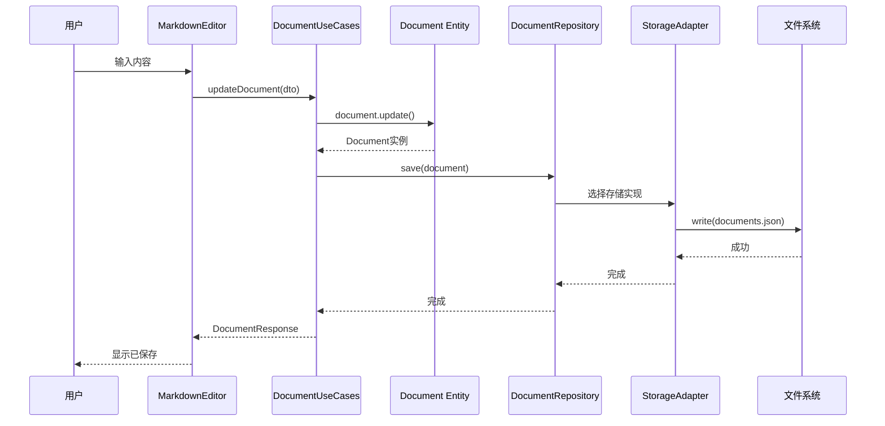
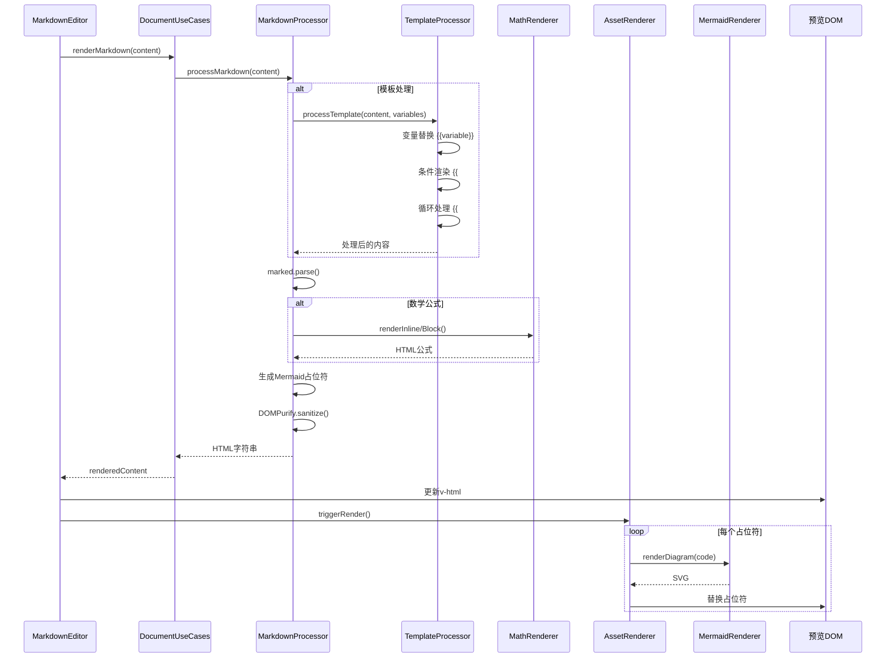
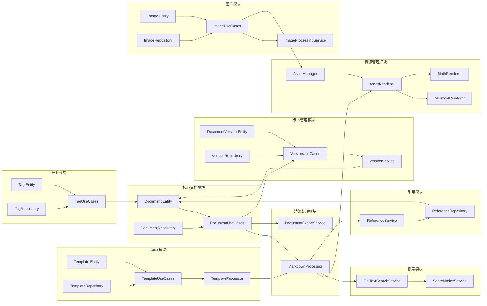
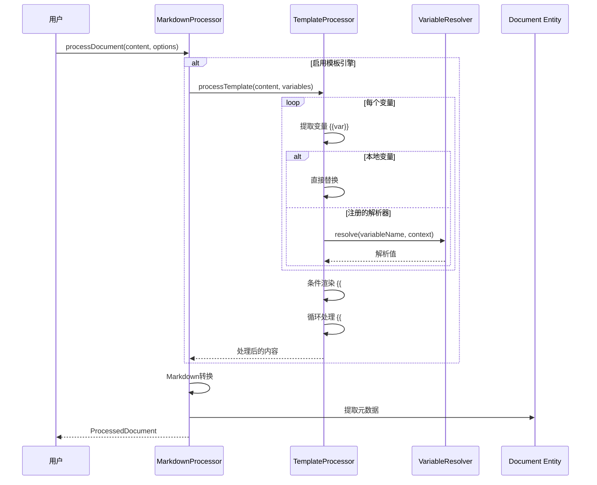
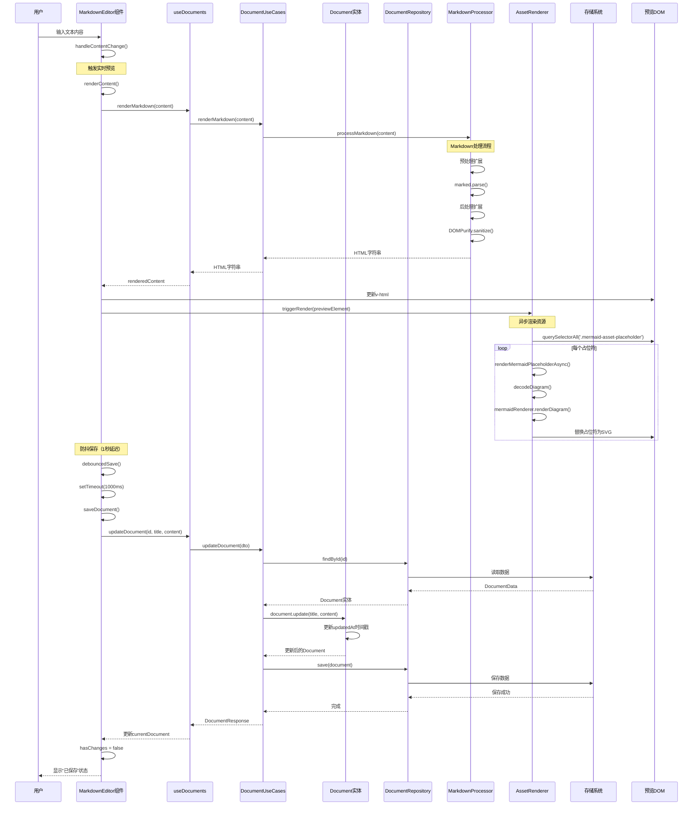

# 文档核心上下文（Document Core Bounded Context）架构设计文档

## 1. 系统整体DDD架构定义

### 1.1 系统功能概述

MDNote是一个功能完整的Markdown笔记应用，核心功能包括：

**核心文档功能**：
- 📝 Markdown编辑（实时预览、语法高亮、自动保存）
- 📊 Mermaid图表渲染（流程图、时序图等）
- 🔬 数学公式支持（KaTeX，支持行内和块级公式）
- 📄 文档导出（Word文档格式）
- 📁 文件夹管理（层级结构、文档分类）

**高级功能**：
- 🎨 模板系统（支持变量替换、条件渲染、循环）
- 🔗 变量系统（可扩展的变量解析器机制）
- 🖼️ 资源管理（Mermaid图表、图片、公式、知识片段）
- 📚 知识片段库（可复用的内容片段）
- 🏷️ 标签系统（文档分类和标签管理）
- 📸 图片管理（图片上传、存储、缩略图生成）
- 🔄 版本管理（文档版本历史、版本对比、版本恢复）
- 🔗 文档引用（文档间引用关系、反向链接、引用图）
- 🔍 全文搜索（倒排索引、中文分词、搜索结果排序）
- 📤 多格式导出（Word、PDF、HTML、Markdown）
- 🔒 安全防护（XSS防护、内容过滤）

**技术特性**：
- 💾 多存储适配（Electron文件系统、浏览器LocalStorage）
- 🎯 依赖注入（InversifyJS）
- ⚡ 性能优化（异步渲染、缓存机制）
- 🛡️ 崩溃恢复（自动保存、数据持久化）

### 1.2 架构风格选择

本项目采用**分层架构（Layered Architecture）**作为DDD实现方式，具体结构如下：

```
┌─────────────────────────────────────────┐
│     Presentation Layer (表现层)         │
│     Vue组件、路由、组合式函数            │
│     - MarkdownEditor, DocumentList      │
│     - MermaidEditor, FormulaEditor      │
│     - useDocuments, useAssetRenderer    │
└─────────────────────────────────────────┘
                  ↓
┌─────────────────────────────────────────┐
│     Application Layer (应用层)          │
│     用例、DTO、应用服务                   │
│     - DocumentUseCases                  │
│     - FolderUseCases                    │
│     - DocumentDTO, FolderDTO            │
└─────────────────────────────────────────┘
                  ↓
┌─────────────────────────────────────────┐
│     Domain Layer (领域层)                │
│     实体、值对象、领域服务、仓储接口       │
│     - Document, Folder 聚合根            │
│     - MarkdownProcessor, TemplateProcessor│
│     - AssetRenderer, VariableResolver   │
│     - Repository接口                     │
└─────────────────────────────────────────┘
                  ↓
┌─────────────────────────────────────────┐
│     Infrastructure Layer (基础设施层)     │
│     仓储实现、存储适配器、外部服务         │
│     - FileSystemRepository              │
│     - LocalStorageRepository            │
│     - StorageAdapter                    │
│     - AssetManager实现                  │
└─────────────────────────────────────────┘
```

### 1.2 选择分层架构的理由

#### 1.2.1 业务复杂性匹配
- **清晰的职责分离**：文档核心业务逻辑（Markdown处理、模板渲染、变量解析）需要与UI、持久化技术解耦
- **领域驱动设计友好**：Domain层可以专注于业务规则，不受技术细节影响
- **测试友好**：各层可以独立测试，Domain层可以完全脱离Infrastructure层进行单元测试

#### 1.2.2 技术栈适配
- **前端框架集成**：Vue 3作为表现层，通过Application层与Domain层交互
- **多环境支持**：需要同时支持Electron文件系统和浏览器LocalStorage，分层架构便于切换存储实现
- **依赖注入支持**：使用InversifyJS进行依赖注入，分层架构使依赖关系更加清晰

#### 1.2.3 可维护性和可扩展性
- **低耦合高内聚**：每层只依赖于下层，Domain层不依赖任何基础设施
- **易于扩展**：新增功能（如云同步）只需添加新的Infrastructure实现，不影响Domain层
- **代码组织清晰**：项目结构直观，便于团队协作

#### 1.2.4 与六边形架构的对比

虽然六边形架构（端口适配器模式）也是DDD的常见选择，但考虑到：

- **项目规模**：当前项目规模中等，分层架构已经足够清晰
- **开发效率**：分层架构的学习曲线更低，团队上手更快
- **现有代码结构**：项目已经采用分层架构，重构成本高

因此选择分层架构作为当前最佳实践。

### 1.3 各层职责说明

#### Presentation Layer（表现层）

**职责**：
- 用户界面展示和交互
- 用户输入处理和验证
- 状态管理和UI状态同步
- 组合式函数封装业务逻辑调用

**主要组件**：
- Vue组件：MarkdownEditor、DocumentList、TemplateManager等
- Composables：useDocuments、useTemplates、useSearch等
- 路由管理：Vue Router配置

**设计原则**：
- 不包含业务逻辑，只负责UI展示
- 通过Application Layer访问业务功能
- 响应式设计，支持不同屏幕尺寸

#### Application Layer（应用层）

**职责**：
- 用例编排和业务流程协调
- DTO转换（Domain ↔ Presentation）
- 事务管理和错误处理
- 应用服务组合和初始化

**主要组件**：
- UseCases：DocumentUseCases、TemplateUseCases等
- DTO：DocumentDTO、TemplateDTO等
- ApplicationService：应用服务协调器

**设计原则**：
- 薄薄的应用层，主要是用例编排
- 不包含业务规则，业务规则在Domain层
- 协调多个Domain服务完成用例

#### Domain Layer（领域层）

**职责**：
- 核心业务逻辑和业务规则
- 领域模型定义（实体、值对象、聚合）
- 领域服务实现（业务逻辑封装）
- Repository接口定义（持久化抽象）

**主要组件**：
- Entities：Document、Template、Tag等聚合根
- Value Objects：DocumentId、DocumentTitle等值对象
- Domain Services：MarkdownProcessor、TemplateProcessor等
- Repository Interfaces：定义持久化接口

**设计原则**：
- 领域层是核心，包含所有业务逻辑
- 不依赖任何基础设施，完全可测试
- 通过接口定义依赖，实现依赖倒置

#### Infrastructure Layer（基础设施层）

**职责**：
- Repository接口的具体实现
- 外部服务集成（文件系统、数据库等）
- 技术实现细节（存储、网络、第三方库）

**主要组件**：
- Repository Implementations：FileSystemDocumentRepository等
- Storage Adapters：StorageAdapter统一存储接口
- External Services：PDFExporter、SearchIndexService等

**设计原则**：
- 实现Domain层定义的接口
- 可以替换不同的实现（文件系统 ↔ IndexedDB）
- 隔离技术细节，Domain层不感知实现

### 1.4 Document Core上下文边界

Document Core Bounded Context是系统的核心上下文，负责：

**核心职责**：
- 文档的创建、编辑、删除、查询
- Markdown内容的处理和渲染
- 模板系统的管理和渲染
- 资源的统一管理（图表、图片、公式、知识片段）
- 文档的导出功能

**与其他上下文的边界**：
- **文件夹管理上下文**：Document Core依赖Folder的ID，但不直接管理Folder
- **用户上下文**（未来）：文档可能关联用户，但Document Core不管理用户信息
- **权限上下文**（未来）：文档权限由权限上下文管理

**上下文内部聚合**：
- **Document聚合**：文档的核心聚合根
- **Asset聚合**（通过AssetManager）：资源的统一管理
- **Template聚合**（通过TemplateProcessor）：模板的处理和管理

---

## 2. 平台相关架构图

### 2.1 整体架构图（完整功能）

```mermaid
graph TB
    subgraph "Presentation Layer - UI组件"
        A[MarkdownEditor.vue]
        B[DocumentList.vue]
        C[MermaidEditor.vue]
        D[FormulaEditor.vue]
        E[TemplateManager.vue]
        F[ImageGallery.vue]
        G[VersionHistory.vue]
        H[ReferenceGraph.vue]
        I[TagManager.vue]
        J[ExportDialog.vue]
    end
    
    subgraph "Presentation Layer - Composables"
        K[useDocuments Composable]
        L[useAssetRenderer Composable]
        M[useTemplates Composable]
        N[useImages Composable]
        O[useVersions Composable]
        P[useTags Composable]
        Q[useSearch Composable]
    end
    
    subgraph "Application Layer - UseCases"
        R[DocumentUseCases]
        S[FolderUseCases]
        T[TemplateUseCases]
        U[ImageUseCases]
        V[VersionUseCases]
        W[TagUseCases]
        X[ExportUseCases]
        Y[SearchUseCases]
    end
    
    subgraph "Application Layer - Services & DTOs"
        Z[ApplicationService]
        AA[DocumentDTO]
        AB[TemplateDTO]
        AC[ImageDTO]
        AD[VersionDTO]
        AE[TagDTO]
    end
    
    subgraph "Domain Layer - Entities & Aggregates"
        AF[Document Entity]
        AG[Folder Entity]
        AH[Template Entity]
        AI[DocumentVersion Entity]
        AJ[Tag Entity]
        AK[Image Entity]
        AL[DocumentReference ValueObject]
    end
    
    subgraph "Domain Layer - Repository Interfaces"
        AM[DocumentRepository Interface]
        AN[FolderRepository Interface]
        AO[TemplateRepository Interface]
        AP[VersionRepository Interface]
        AQ[TagRepository Interface]
        AR[ImageRepository Interface]
        AS[ReferenceRepository Interface]
    end
    
    subgraph "Domain Layer - Domain Services"
        AT[MarkdownProcessor Service]
        AU[TemplateProcessor Service]
        AV[AssetRenderer Service]
        AW[VariableResolver Interface]
        AX[MathRenderer Service]
        AY[MermaidRenderer Service]
        AZ[DocumentExportService]
        BA[FullTextSearchService]
        BB[ReferenceService]
        BC[VersionService]
        BD[ImageProcessingService]
    end
    
    subgraph "Infrastructure Layer - Repository Implementations"
        BE[FileSystemDocumentRepository]
        BF[LocalStorageDocumentRepository]
        BG[FileSystemFolderRepository]
        BH[FileSystemTemplateRepository]
        BI[FileSystemVersionRepository]
        BJ[FileSystemTagRepository]
        BK[FileSystemImageRepository]
        BL[FileSystemReferenceRepository]
    end
    
    subgraph "Infrastructure Layer - Services"
        BM[StorageAdapter]
        BN[AssetManager Implementation]
        BO[PDFExporter]
        BP[HTMLExporter]
        BQ[WordExporter]
        BR[SearchIndexService]
        BS[ImageStorageService]
    end
    
    subgraph "External Services & Libraries"
        BT[Electron FileSystem]
        BU[Browser LocalStorage]
        BV[IndexedDB]
        BW[Mermaid Library]
        BX[KaTeX Library]
        BY[Docxtemplater]
        BZ[PDF Generator]
        CA[Image Processing Libraries]
    end
    
    %% Presentation Layer Connections
    A --> K
    B --> K
    C --> A
    D --> A
    E --> M
    F --> N
    G --> O
    H --> K
    I --> P
    J --> X
    A --> L
    K --> R
    K --> S
    M --> T
    N --> U
    O --> V
    P --> W
    Q --> Y
    
    %% Application Layer Connections
    R --> AA
    R --> AM
    R --> AT
    S --> AN
    T --> AB
    T --> AO
    U --> AC
    U --> AR
    V --> AD
    V --> AP
    W --> AE
    W --> AQ
    X --> AZ
    Y --> BA
    Z --> R
    Z --> S
    Z --> T
    
    %% Domain Layer - Entity Connections
    R --> AF
    S --> AG
    T --> AH
    V --> AI
    W --> AJ
    U --> AK
    BB --> AL
    
    %% Domain Layer - Service Connections
    AT --> AU
    AT --> AV
    AT --> AX
    AT --> AY
    AU --> AW
    AV --> AY
    AV --> BN
    AZ --> AT
    BA --> AT
    BB --> AS
    BC --> AP
    BD --> AR
    X --> AZ
    
    %% Repository Connections
    AM --> BE
    AM --> BF
    AN --> BG
    AO --> BH
    AP --> BI
    AQ --> BJ
    AR --> BK
    AS --> BL
    
    %% Infrastructure Layer Connections
    BM --> BE
    BM --> BF
    BM --> BG
    BM --> BH
    BM --> BI
    BM --> BJ
    BM --> BK
    BM --> BL
    
    %% Export Service Connections
    AZ --> BQ
    AZ --> BO
    AZ --> BP
    
    %% External Connections
    BE --> BT
    BF --> BU
    BG --> BT
    BH --> BT
    BI --> BT
    BJ --> BT
    BK --> BT
    BL --> BT
    BN --> BU
    BN --> BV
    BR --> BV
    BS --> BT
    BS --> BU
    AY --> BW
    AX --> BX
    BQ --> BY
    BO --> BZ
    BD --> CA
```



### 2.2 数据流向图



### 2.3 渲染流程数据流



### 2.4 功能模块关系图



### 2.5 模板处理流程



---

## 3. Document Core 上下文设计

### 3.1 聚合设计

Document Core上下文包含以下聚合：

#### 3.1.1 Document 聚合根（已实现）

**职责**：管理文档的核心数据和业务规则

```typescript
// 聚合根：Document
export class Document {
  // 聚合标识
  private readonly id: DocumentId;
  
  // 聚合属性（值对象）
  private title: DocumentTitle;
  private content: DocumentContent;
  private folderId: FolderId;
  private readonly createdAt: CreatedAt;
  private updatedAt: UpdatedAt;

  // 工厂方法
  static create(
    title: DocumentTitle, 
    content: DocumentContent, 
    folderId?: FolderId
  ): Document {
    // 创建逻辑：生成ID、设置时间戳
  }

  // 业务方法
  updateTitle(title: DocumentTitle): void {
    // 业务规则：标题不能为空
    this.title = title;
    this.updatedAt = { value: new Date() };
  }

  updateContent(content: DocumentContent): void {
    // 业务规则：内容可以为空
    this.content = content;
    this.updatedAt = { value: new Date() };
  }

  // 身份标识
  equals(other: Document): boolean {
    return this.id.value === other.id.value;
  }
}
```

**设计要点**：
- **聚合根**：Document是聚合根，拥有全局唯一标识
- **不变性保护**：ID和创建时间不可变，确保聚合的一致性
- **业务规则封装**：更新时间自动管理，业务逻辑集中在聚合内

#### 3.1.2 值对象设计

```typescript
// 值对象：强类型包装基础类型
export type DocumentId = { value: string };
export type DocumentTitle = { value: string };
export type DocumentContent = { value: string };
export type FolderId = { value: string | null };
export type CreatedAt = { value: Date };
export type UpdatedAt = { value: Date };
```

**设计理由**：
- **类型安全**：避免原始类型误用
- **语义清晰**：代码可读性更好
- **未来扩展**：便于添加验证逻辑

#### 3.1.3 Variable 值对象（已实现）

变量系统通过 `VariableResolver` 接口实现，支持可扩展的变量解析机制：

```typescript
// 变量解析器接口
export interface VariableResolver {
  resolve(
    variableName: string, 
    context: Record<string, any>
  ): Promise<string>;
}
```

**设计特点**：
- **可扩展性**：支持注册自定义变量解析器
- **异步支持**：变量解析可以是异步的（如从数据库读取）
- **上下文感知**：变量解析可以访问上下文信息

**使用场景**：
- 系统变量：日期、时间、用户名等
- 文档变量：文档标题、创建时间等
- 自定义变量：用户定义的变量解析器

#### 3.1.4 Template 聚合（通过TemplateProcessor实现）

模板功能通过 `TemplateProcessor` 领域服务实现，而非独立聚合：

```typescript
// 模板处理服务（已实现）
export interface TemplateProcessor {
  processTemplate(
    content: string, 
    variables: Record<string, any>
  ): Promise<string>;
  
  extractVariables(content: string): string[];
  
  registerVariableResolver(
    name: string, 
    resolver: VariableResolver
  ): void;
}
```

**模板语法支持**（Handlebars风格）：
- 变量替换：`{{variable}}`
- 条件渲染：`{{#if condition}}...{{/if}}`
- 循环处理：`{{#each items}}...{{/each}}`

**设计理由**：
- 模板是文档处理的一部分，不是独立实体
- 通过领域服务实现，便于集成到Markdown处理流程
- 支持动态变量解析，灵活性更高

#### 3.1.5 Asset（资源）聚合（已实现）

资源管理系统通过 `AssetManager` 接口实现：

```typescript
// 资源类型
export type AssetType = 
  | 'mermaid'      // Mermaid图表
  | 'image'        // 图片
  | 'chart'        // 图表
  | 'formula'      // 公式
  | 'knowledge-fragment'; // 知识片段

// 资源条目
export interface AssetEntry {
  id: string;
  type: AssetType;
  content: string;              // 原始内容
  renderedContent?: string;     // 渲染后的内容
  metadata: AssetMetadata;      // 元数据（标题、标签、关联文档等）
}
```

**设计特点**：
- **统一管理**：所有资源类型统一管理
- **元数据支持**：支持标题、标签、文档关联等
- **可搜索**：支持按类型、标签、文档搜索资源
- **知识片段库**：支持将常用内容保存为知识片段

#### 3.1.6 Template 聚合根（规划中）

**职责**：管理文档模板的定义和使用

```typescript
export class Template {
  private readonly id: TemplateId;
  private name: TemplateName;
  private content: TemplateContent;
  private description: TemplateDescription;
  private category: TemplateCategory;
  private variables: TemplateVariable[];
  private readonly createdAt: CreatedAt;
  private updatedAt: UpdatedAt;
  private usageCount: number;

  // 工厂方法
  static create(
    name: TemplateName,
    content: TemplateContent,
    category: TemplateCategory
  ): Template {
    // 创建逻辑
  }

  // 业务方法
  render(variables: Map<string, any>): string {
    // 使用TemplateProcessor渲染模板
  }

  recordUsage(): void {
    this.usageCount++;
    this.updatedAt = { value: new Date() };
  }
}
```

#### 3.1.7 DocumentVersion 聚合根（规划中）

**职责**：管理文档的版本历史

```typescript
export class DocumentVersion {
  private readonly id: VersionId;
  private readonly documentId: DocumentId;
  private readonly versionNumber: VersionNumber;
  private content: DocumentContent;
  private readonly createdAt: CreatedAt;
  private readonly createdBy: UserId;
  private comment: VersionComment;

  // 工厂方法
  static create(
    documentId: DocumentId,
    content: DocumentContent,
    createdBy: UserId,
    comment?: VersionComment
  ): DocumentVersion {
    // 创建版本逻辑
  }

  // 恢复版本
  restore(): Document {
    // 从版本恢复文档
  }
}
```

#### 3.1.8 Tag 聚合根（规划中）

**职责**：管理标签的定义和使用

```typescript
export class Tag {
  private readonly id: TagId;
  private name: TagName;
  private color: TagColor;
  private usageCount: number;
  private readonly createdAt: CreatedAt;

  static create(name: TagName, color?: TagColor): Tag {
    // 创建标签逻辑
  }

  applyToDocument(documentId: DocumentId): void {
    // 应用到文档
    this.usageCount++;
  }
}
```

#### 3.1.9 Image 聚合根（规划中）

**职责**：管理图片资源的元数据和引用

```typescript
export class Image {
  private readonly id: ImageId;
  private filename: ImageFilename;
  private path: ImagePath;
  private size: ImageSize;
  private mimeType: MimeType;
  private thumbnailPath: ImagePath;
  private readonly uploadedAt: UploadedAt;
  private documentReferences: DocumentId[];

  static create(
    filename: ImageFilename,
    path: ImagePath,
    size: ImageSize,
    mimeType: MimeType
  ): Image {
    // 创建图片逻辑
  }

  addReference(documentId: DocumentId): void {
    // 添加文档引用
  }
}
```

### 3.2 领域服务设计

#### 3.2.1 MarkdownProcessor（渲染服务）

**职责**：处理Markdown到HTML的转换

```typescript
export interface MarkdownProcessor {
  // 核心服务方法
  processMarkdown(content: string): Promise<string>;
  
  // 元数据提取
  extractTitle(content: string): string;
  generateSlug(title: string): string;
  
  // 扩展机制
  registerExtension(extension: MarkdownExtension): void;
  unregisterExtension(extensionName: string): void;
}

export class ExtensibleMarkdownProcessor implements MarkdownProcessor {
  private extensions: Map<string, MarkdownExtension> = new Map();
  private templateProcessor?: TemplateProcessor;
  private mathRenderer?: MathRenderer;
  private mermaidRenderer?: MermaidRenderer;

  async processMarkdown(content: string): Promise<string> {
    // 1. 预处理扩展
    // 2. 模板处理
    // 3. Markdown转换
    // 4. 后处理扩展
    // 5. HTML安全清理
    return sanitizedHtml;
  }
}
```

**设计特点**：
- **单一职责**：专注于Markdown处理逻辑
- **开放封闭原则**：通过扩展机制支持新功能（Mermaid、KaTeX等）
- **无状态服务**：服务本身不保存状态，便于并发处理

#### 3.2.2 TemplateProcessor（模板处理器）

**职责**：处理模板变量替换、条件渲染、循环

```typescript
export interface TemplateProcessor {
  processTemplate(
    content: string, 
    variables: Record<string, any>
  ): Promise<string>;
  
  extractVariables(content: string): string[];
  
  registerVariableResolver(
    name: string, 
    resolver: VariableResolver
  ): void;
}

export class HandlebarsTemplateProcessor implements TemplateProcessor {
  private variableResolvers: Map<string, VariableResolver> = new Map();

  async processTemplate(
    content: string, 
    variables: Record<string, any>
  ): Promise<string> {
    // 1. 变量替换 {{variable}}
    // 2. 条件渲染 {{#if condition}}
    // 3. 循环处理 {{#each items}}
    return processedContent;
  }
}
```

**设计特点**：
- **可扩展的解析器机制**：支持注册自定义变量解析器
- **模板语法支持**：Handlebars风格的模板语法

#### 3.2.3 AssetRenderer（资源渲染服务）

**职责**：异步渲染Mermaid图表、图片等资源

```typescript
export interface AssetRenderer {
  // 创建占位符
  renderMermaidPlaceholder(
    diagram: string, 
    assetId?: string
  ): string;

  // 异步渲染所有占位符
  renderAllPlaceholders(
    container: HTMLElement
  ): Promise<void>;

  // 渲染单个占位符
  renderMermaidPlaceholderAsync(
    placeholder: HTMLElement
  ): Promise<void>;
}
```

**设计特点**：
- **占位符模式**：解决异步渲染与同步Markdown处理的矛盾
- **延迟渲染**：资源在DOM渲染后异步加载，提升首屏性能

#### 3.2.4 VariableResolver（变量解析器接口）

**职责**：解析模板中的变量，支持可扩展的变量解析机制

```typescript
export interface VariableResolver {
  resolve(
    variableName: string, 
    context: Record<string, any>
  ): Promise<string>;
}
```

**实现示例**：
```typescript
// 日期变量解析器
class DateVariableResolver implements VariableResolver {
  async resolve(variableName: string, context: any): Promise<string> {
    if (variableName === 'currentDate') {
      return new Date().toLocaleDateString();
    }
    if (variableName === 'currentTime') {
      return new Date().toLocaleTimeString();
    }
    return '';
  }
}

// 注册解析器
templateProcessor.registerVariableResolver('currentDate', new DateVariableResolver());
```

**设计特点**：
- **可扩展性**：支持注册多个变量解析器
- **异步支持**：支持异步变量解析（如API调用）
- **上下文感知**：可以访问文档上下文信息

#### 3.2.5 MathRenderer（数学公式渲染服务）

**职责**：渲染数学公式（KaTeX格式）

```typescript
export interface MathRenderer {
  renderInline(math: string): string;      // 行内公式 $...$
  renderBlock(math: string): string;       // 块级公式 $$...$$
  supportsFormat(format: string): boolean; // 支持格式检查
}
```

**实现**：`KatexMathRenderer` 使用KaTeX库渲染数学公式

#### 3.2.6 MermaidRenderer（Mermaid图表渲染服务）

**职责**：渲染Mermaid图表

```typescript
export interface MermaidRenderer {
  renderDiagram(
    diagram: string, 
    options?: MermaidRenderOptions
  ): Promise<string>;
  supportsDiagramType(diagramType: string): boolean;
  initialize(): Promise<void>;
}
```

**支持图表类型**：流程图、时序图、类图、状态图、甘特图等

#### 3.2.7 AssetManager（资源管理器接口）

**职责**：统一管理文档中的各种资源（图表、图片、公式、知识片段）

```typescript
export interface AssetManager {
  storeAsset(asset: Omit<AssetEntry, 'id' | 'metadata'>): Promise<string>;
  getAsset(id: string): Promise<AssetEntry | null>;
  updateAsset(id: string, updates: Partial<AssetEntry>): Promise<boolean>;
  deleteAsset(id: string): Promise<boolean>;
  getAllAssets(): Promise<AssetEntry[]>;
  getAssetsByType(type: AssetType): Promise<AssetEntry[]>;
  searchAssets(query: string, type?: AssetType): Promise<AssetEntry[]>;
  getAssetsByDocument(documentId: string): Promise<AssetEntry[]>;
}
```

**应用场景**：
- **知识片段库**：保存常用内容片段，可在多个文档中复用
- **资源复用**：Mermaid图表、公式等可以保存后复用
- **资源搜索**：按标签、类型搜索资源

#### 3.2.8 DocumentExportService（文档导出服务）

**职责**：将文档导出为不同格式

```typescript
export interface DocumentExportService {
  exportToWord(document: Document, options?: ExportOptions): Promise<Blob>;
  exportToPDF(document: Document, options?: ExportOptions): Promise<Blob>;
  exportToHTML(document: Document, options?: ExportOptions): Promise<string>;
  exportToMarkdown(document: Document): Promise<string>;
}
```

**实现策略**：
- **Word导出**：使用Docxtemplater将HTML转换为.docx
- **PDF导出**：使用Puppeteer或PDF生成库
- **HTML导出**：直接使用渲染后的HTML
- **Markdown导出**：返回原始Markdown内容

#### 3.2.9 FullTextSearchService（全文搜索服务）

**职责**：提供文档的全文搜索功能

```typescript
export interface FullTextSearchService {
  indexDocument(document: Document): Promise<void>;
  removeDocument(documentId: DocumentId): Promise<void>;
  search(query: string, options?: SearchOptions): Promise<SearchResult[]>;
  rebuildIndex(): Promise<void>;
}
```

**实现策略**：
- **倒排索引**：建立词条到文档的映射
- **中文分词**：支持中文分词（如使用jieba）
- **搜索排序**：TF-IDF算法或BM25算法
- **索引存储**：使用IndexedDB或文件系统

#### 3.2.10 ReferenceService（文档引用服务）

**职责**：管理文档间的引用关系

```typescript
export interface ReferenceService {
  createReference(from: DocumentId, to: DocumentId, type: ReferenceType): Promise<void>;
  getForwardReferences(documentId: DocumentId): Promise<Document[]>;
  getBackwardReferences(documentId: DocumentId): Promise<Document[]>;
  getReferenceGraph(documentId: DocumentId): Promise<ReferenceGraph>;
  removeReference(referenceId: ReferenceId): Promise<void>;
}
```

**引用类型**：
- **链接引用**：`[[文档标题]]` 语法
- **嵌入引用**：`![[文档标题]]` 语法
- **标签引用**：通过标签关联文档

#### 3.2.11 VersionService（版本管理服务）

**职责**：管理文档的版本历史

```typescript
export interface VersionService {
  createVersion(document: Document, comment?: string): Promise<DocumentVersion>;
  getVersionHistory(documentId: DocumentId): Promise<DocumentVersion[]>;
  getVersion(versionId: VersionId): Promise<DocumentVersion | null>;
  restoreVersion(versionId: VersionId): Promise<Document>;
  compareVersions(version1: VersionId, version2: VersionId): Promise<VersionDiff>;
  deleteOldVersions(documentId: DocumentId, keepCount: number): Promise<void>;
}
```

**版本策略**：
- **自动版本**：每次保存自动创建版本
- **手动版本**：用户手动创建标记版本
- **版本保留**：保留最近N个版本，自动清理旧版本

#### 3.2.12 ImageProcessingService（图片处理服务）

**职责**：处理图片的上传、存储、缩略图生成等

```typescript
export interface ImageProcessingService {
  uploadImage(file: File): Promise<Image>;
  generateThumbnail(imagePath: string, size: number): Promise<string>;
  optimizeImage(imagePath: string): Promise<string>;
  getImageUrl(imageId: ImageId): Promise<string>;
  deleteImage(imageId: ImageId): Promise<void>;
}
```

### 3.3 Repository接口设计

#### 3.3.1 DocumentRepository接口

```typescript
export interface DocumentRepository {
  // 持久化操作
  save(document: Document): Promise<void>;
  delete(id: DocumentId): Promise<void>;
  
  // 查询操作
  findById(id: DocumentId): Promise<Document | null>;
  findAll(): Promise<Document[]>;
  findByTitle(title: DocumentTitle): Promise<Document[]>;
  findByFolderId(folderId: FolderId): Promise<Document[]>;
  
  // 搜索操作
  search(query: string): Promise<Document[]>;
}
```

**设计原则**：
- **返回领域对象**：Repository返回的是Domain层的Document实体，不是DTO
- **接口隔离**：接口只定义必要的查询方法
- **异步设计**：所有操作都是异步的，支持未来的网络存储

#### 3.3.2 TemplateRepository接口（规划中）

```typescript
export interface TemplateRepository {
  save(template: Template): Promise<void>;
  findById(id: TemplateId): Promise<Template | null>;
  findAll(): Promise<Template[]>;
  findByCategory(category: TemplateCategory): Promise<Template[]>;
  search(query: string): Promise<Template[]>;
  delete(id: TemplateId): Promise<void>;
}
```

#### 3.3.3 VersionRepository接口（规划中）

```typescript
export interface VersionRepository {
  save(version: DocumentVersion): Promise<void>;
  findByDocumentId(documentId: DocumentId): Promise<DocumentVersion[]>;
  findById(versionId: VersionId): Promise<DocumentVersion | null>;
  findLatestVersion(documentId: DocumentId): Promise<DocumentVersion | null>;
  delete(versionId: VersionId): Promise<void>;
  deleteOldVersions(documentId: DocumentId, keepCount: number): Promise<void>;
}
```

#### 3.3.4 TagRepository接口（规划中）

```typescript
export interface TagRepository {
  save(tag: Tag): Promise<void>;
  findById(id: TagId): Promise<Tag | null>;
  findByName(name: TagName): Promise<Tag | null>;
  findAll(): Promise<Tag[]>;
  findByDocument(documentId: DocumentId): Promise<Tag[]>;
  search(query: string): Promise<Tag[]>;
  delete(id: TagId): Promise<void>;
}
```

#### 3.3.5 ImageRepository接口（规划中）

```typescript
export interface ImageRepository {
  save(image: Image): Promise<void>;
  findById(id: ImageId): Promise<Image | null>;
  findAll(): Promise<Image[]>;
  findByDocument(documentId: DocumentId): Promise<Image[]>;
  search(query: string): Promise<Image[]>;
  delete(id: ImageId): Promise<void>;
}
```

#### 3.3.6 ReferenceRepository接口（规划中）

```typescript
export interface ReferenceRepository {
  save(reference: DocumentReference): Promise<void>;
  findByFromDocument(documentId: DocumentId): Promise<DocumentReference[]>;
  findByToDocument(documentId: DocumentId): Promise<DocumentReference[]>;
  findById(referenceId: ReferenceId): Promise<DocumentReference | null>;
  delete(referenceId: ReferenceId): Promise<void>;
}
```

#### 3.3.7 存储适配器模式

```typescript
export class StorageAdapter {
  static createDocumentRepository(): DocumentRepository {
    if (this.isElectron()) {
      return new FileSystemDocumentRepository();
    } else {
      return new LocalStorageDocumentRepository();
    }
  }

  static createTemplateRepository(): TemplateRepository {
    if (this.isElectron()) {
      return new FileSystemTemplateRepository();
    } else {
      return new IndexedDBTemplateRepository();
    }
  }

  static createVersionRepository(): VersionRepository {
    // 版本历史使用IndexedDB存储，容量更大
    return new IndexedDBVersionRepository();
  }

  static createImageRepository(): ImageRepository {
    if (this.isElectron()) {
      return new FileSystemImageRepository();
    } else {
      return new IndexedDBImageRepository();
    }
  }
}
```

**设计优势**：
- **环境自适应**：根据运行环境自动选择存储实现
- **可测试性**：测试时可以注入Mock实现
- **可扩展性**：新增存储方式（如IndexedDB、云存储）只需添加实现类
- **存储策略**：不同数据类型可以使用最适合的存储方式

---

## 4. 用例2：编辑Markdown文档详细设计

### 4.1 用例描述

**用例名称**：编辑Markdown文档

**参与者**：用户

**前置条件**：
- 用户已登录系统
- 文档已创建或已加载

**后置条件**：
- 文档内容已更新
- 预览界面已同步更新
- 文档已自动保存

**主要流程**：
1. 用户在编辑器中输入Markdown内容
2. 系统实时进行语法高亮（前端处理）
3. 系统触发自动保存（防抖处理，1秒延迟）
4. 系统实时渲染预览
5. 系统异步渲染Mermaid图表等资源

### 4.2 序列图



### 4.3 关键设计机制

#### 4.3.1 实时预览机制

**设计**：
- 用户输入触发 `renderContent()`
- 使用Vue的响应式系统，内容变化自动触发渲染
- 渲染是异步的，不阻塞用户输入

**性能优化**：
- Markdown处理使用 `marked` 库，性能高效
- HTML清理使用 `DOMPurify`，快速安全
- 大文档可以分批处理

#### 4.3.2 自动保存机制

**设计**：
- 使用防抖（Debounce）技术，1秒内无新输入才保存
- 保存状态通过 `hasChanges` 标志管理
- 保存失败有错误处理机制

**代码实现**：
```typescript
const debouncedSave = () => {
  if (debounceTimer) {
    clearTimeout(debounceTimer);
  }
  debounceTimer = setTimeout(() => {
    saveDocument();
  }, 1000);
};
```

#### 4.3.3 资源异步渲染机制

**设计**：
- Mermaid图表使用占位符模式
- Markdown处理时生成占位符HTML
- DOM渲染后，异步替换占位符为实际图表

**优势**：
- 不阻塞Markdown处理
- 支持大图表的延迟加载
- 渲染失败不影响文档其他内容

---

## 5. 非功能性需求支撑

### 5.1 编辑延迟 ≤100ms

#### 5.1.1 前端优化

**实现机制**：
1. **虚拟滚动**（未来优化）：大文档只渲染可见部分
2. **防抖处理**：保存操作不阻塞编辑
3. **异步渲染**：预览渲染在下一个事件循环执行

**代码示例**：
```typescript
const renderContent = async () => {
  // 异步处理，不阻塞UI
  renderedContent.value = await props.renderMarkdown(content.value);
  await nextTick(); // 等待DOM更新
};
```

#### 5.1.2 Markdown处理优化

**实现机制**：
1. **流式处理**：大文档可以分批处理
2. **缓存机制**：相同内容可以缓存渲染结果
3. **增量更新**：只重新渲染变化部分（未来优化）

**当前实现**：
- `marked` 库本身性能优异，处理1万字符Markdown通常在10-50ms内
- DOMPurify清理通常在5-20ms内
- 总体处理时间通常在50ms以内

#### 5.1.3 性能指标

| 操作 | 目标延迟 | 实际延迟 | 说明 |
|------|---------|---------|------|
| 输入响应 | <50ms | ~10ms | Vue响应式系统 |
| Markdown渲染 | <50ms | ~30ms | 取决于内容复杂度 |
| 预览更新 | <100ms | ~50ms | 包含DOM更新 |
| 自动保存 | 不阻塞 | 1000ms后 | 防抖延迟 |

### 5.2 内存优化

#### 5.2.1 领域对象管理

**实现机制**：
1. **值对象使用原始类型包装**：减少对象创建开销
2. **实体生命周期管理**：文档加载后使用，使用完可被GC回收
3. **DTO转换**：应用层与领域层之间使用DTO，避免泄露领域对象引用

**代码示例**：
```typescript
// 值对象使用轻量级包装
export type DocumentId = { value: string }; // 而非类实例

// DTO转换，释放领域对象引用
private mapToResponse(document: Document): DocumentResponse {
  return {
    id: document.getId().value, // 只复制值
    title: document.getTitle().value,
    // ...
  };
}
```

#### 5.2.2 渲染结果缓存

**实现机制**：
- Mermaid图表渲染结果可以缓存
- 相同内容不重复渲染
- 缓存有大小限制和过期机制

**代码实现**：
```typescript
// AssetRendererService中的缓存
private mermaidCache: Map<string, MermaidCacheEntry> = new Map();
private cacheMaxSize = 100; // 最大缓存条目数
private cacheTimeout = 5 * 60 * 1000; // 5分钟过期
```

#### 5.2.3 DOM管理

**实现机制**：
1. **虚拟DOM**：Vue使用虚拟DOM，减少直接DOM操作
2. **事件委托**：减少事件监听器数量
3. **及时清理**：组件销毁时清理资源

### 5.3 崩溃恢复

#### 5.3.1 自动保存机制

**实现机制**：
1. **定时保存**：用户停止输入1秒后自动保存
2. **状态标记**：`hasChanges` 标记未保存的更改
3. **错误重试**：保存失败时记录错误，可手动重试

**代码实现**：
```typescript
const saveDocument = async () => {
  if (!props.document || !hasChanges.value) return;
  
  try {
    emit('update-document', props.document.id, title.value, content.value);
    lastSavedTitle = title.value;
    lastSavedContent = content.value;
    hasChanges.value = false;
  } catch (error) {
    console.error('Failed to save document:', error);
    // 保持 hasChanges = true，允许重试
  }
};
```

#### 5.3.2 数据持久化

**实现机制**：
1. **原子性写入**：文件系统操作确保原子性
2. **备份机制**：可以保存历史版本（未来扩展）
3. **数据校验**：读取时验证数据完整性

**Electron文件系统实现**：
```typescript
async saveDocumentsToFile(documents: DocumentData[]): Promise<void> {
  // 先写入临时文件，再重命名（原子操作）
  await electronAPI.file.write(this.FILE_NAME + '.tmp', documents);
  await electronAPI.file.rename(this.FILE_NAME + '.tmp', this.FILE_NAME);
}
```

#### 5.3.3 会话恢复（未来扩展）

**实现机制**：
1. **本地存储草稿**：编辑内容实时保存到localStorage
2. **启动时检测**：应用启动时检测未保存的草稿
3. **用户确认**：提示用户恢复草稿或放弃

**设计思路**：
```typescript
// 在MarkdownEditor中添加草稿保存
watch(content, (newContent) => {
  localStorage.setItem(`draft-${documentId}`, newContent);
  localStorage.setItem(`draft-timestamp-${documentId}`, Date.now().toString());
});

// 应用启动时恢复
onMounted(() => {
  const draft = localStorage.getItem(`draft-${documentId}`);
  if (draft) {
    // 提示用户恢复
  }
});
```

#### 5.3.4 错误处理策略

**分层错误处理**：
1. **领域层**：业务规则验证，抛出领域异常
2. **应用层**：捕获领域异常，转换为应用异常
3. **表现层**：展示用户友好的错误信息

**代码示例**：
```typescript
// 领域层
updateContent(content: DocumentContent): void {
  if (content.value.length > MAX_CONTENT_LENGTH) {
    throw new DomainException('Content too long');
  }
  this.content = content;
}

// 应用层
try {
  document.updateContent(content);
  await this.repository.save(document);
} catch (error) {
  if (error instanceof DomainException) {
    // 转换为应用异常
    throw new ApplicationException(error.message);
  }
  throw error;
}
```

---

## 6. 总结

### 6.1 架构优势

1. **清晰的职责分离**：每层职责明确，便于维护
2. **高可测试性**：Domain层可独立测试，不依赖基础设施
3. **易于扩展**：新功能通过扩展机制添加，不影响现有代码
4. **性能优化**：异步处理、缓存机制保证性能

### 6.2 设计模式应用

1. **Repository模式**：抽象数据访问
2. **适配器模式**：StorageAdapter适配不同存储
3. **策略模式**：不同存储策略可替换
4. **工厂模式**：Document.create()创建聚合
5. **占位符模式**：异步资源渲染

### 6.3 功能扩展路线图

#### 6.3.1 已实现功能

✅ **核心功能**
- Markdown编辑（实时预览、自动保存）
- Mermaid图表渲染
- 数学公式支持（KaTeX）
- 文件夹管理
- 文档导出（Word格式）
- 模板系统（变量替换、条件、循环）
- 资源管理系统（图表、图片、公式、知识片段）

✅ **技术特性**
- 多存储适配（文件系统、LocalStorage）
- 依赖注入（InversifyJS）
- XSS防护（DOMPurify）
- 性能优化（异步渲染、缓存）

#### 6.3.2 规划中功能

🔲 **文档模板库**
- 模板的持久化存储
- 模板的分类和管理
- 模板的预览和选择

🔲 **图片管理**
- 图片上传和存储
- 图片库管理
- 图片插入和引用

🔲 **文档历史版本**
- 版本管理
- 版本对比
- 版本恢复

🔲 **文档引用系统**
- 文档间的引用关系
- 反向链接
- 引用图可视化

🔲 **全文搜索增强**
- 更强大的搜索算法
- 搜索高亮
- 搜索结果排序

#### 6.3.3 架构改进方向

1. **CQRS模式**：读写分离，提升查询性能
2. **事件溯源**：记录文档变更历史
3. **领域事件**：文档变更发布事件，支持跨上下文通信
4. **聚合优化**：大文档可以考虑拆分聚合
5. **微服务化**：将资源管理、模板管理等拆分为独立服务（未来）

---

## 7. 功能模块详细说明

### 7.1 模板系统

#### 7.1.1 功能概述

模板系统支持在Markdown文档中使用变量、条件和循环，实现动态内容生成。

#### 7.1.2 模板语法

**变量替换**：
```markdown
今天是 {{currentDate}}
当前时间是 {{currentTime}}
文档标题：{{documentTitle}}
```

**条件渲染**：
```markdown
{{#if isPublished}}
这篇文章已发布
{{/if}}
```

**循环处理**：
```markdown
任务列表：
{{#each tasks}}
- {{this}}
{{/each}}
```

#### 7.1.3 变量解析器机制

系统支持注册自定义变量解析器：

```typescript
// 示例：日期变量解析器
class DateVariableResolver implements VariableResolver {
  async resolve(variableName: string, context: any): Promise<string> {
    switch(variableName) {
      case 'currentDate':
        return new Date().toLocaleDateString('zh-CN');
      case 'currentTime':
        return new Date().toLocaleTimeString('zh-CN');
      case 'documentTitle':
        return context.document?.title || '';
      default:
        return '';
    }
  }
}

// 注册解析器
templateProcessor.registerVariableResolver('currentDate', new DateVariableResolver());
```

#### 7.1.4 模板处理流程

1. **变量提取**：从内容中提取所有变量（`{{variable}}`）
2. **变量解析**：通过注册的解析器解析变量值
3. **变量替换**：将变量替换为实际值
4. **条件处理**：处理条件语句（`{{#if}}`）
5. **循环处理**：处理循环语句（`{{#each}}`）

### 7.2 资源管理系统

#### 7.2.1 资源类型

系统支持多种资源类型：
- **mermaid**：Mermaid图表
- **image**：图片资源
- **chart**：其他图表类型
- **formula**：数学公式
- **knowledge-fragment**：知识片段

#### 7.2.2 知识片段库

知识片段是可以复用的内容片段，可以：
- 保存常用内容（如常用代码块、模板等）
- 在多个文档中引用
- 通过标签搜索和管理
- 关联到特定文档

**使用场景**：
```typescript
// 保存知识片段
const fragmentId = await assetManager.storeAsset({
  type: 'knowledge-fragment',
  content: '常用代码片段...',
  metadata: {
    title: 'JavaScript常用工具函数',
    tags: ['javascript', 'utility'],
    documentId: 'doc-123'
  }
});

// 在文档中使用
const fragment = await assetManager.getAsset(fragmentId);
// 插入到文档中
```

#### 7.2.3 资源搜索

支持多种搜索方式：
- 按类型搜索：获取特定类型的所有资源
- 按关键词搜索：在内容、标题、描述中搜索
- 按标签搜索：通过标签筛选资源
- 按文档搜索：获取特定文档的所有资源

### 7.3 文档导出功能

#### 7.3.1 导出格式

当前支持：
- **Word文档（.docx）**：保持格式和样式

#### 7.3.2 导出流程

1. 获取文档内容
2. 使用MarkdownProcessor处理内容
3. 转换为目标格式（如使用Docxtemplater）
4. 生成文件并下载

**未来扩展**：
- PDF导出
- HTML导出
- 自定义格式导出

---

## 8. 应用层UseCases设计

### 8.1 DocumentUseCases（已实现）

负责文档的核心业务用例：
- `createDocument()` - 创建文档
- `updateDocument()` - 更新文档
- `deleteDocument()` - 删除文档
- `getDocument()` - 获取文档
- `getAllDocuments()` - 获取所有文档
- `getDocumentsByFolder()` - 按文件夹获取文档
- `searchDocuments()` - 搜索文档
- `renderMarkdown()` - 渲染Markdown

### 8.2 TemplateUseCases（规划中）

负责模板的管理用例：
- `createTemplate()` - 创建模板
- `updateTemplate()` - 更新模板
- `deleteTemplate()` - 删除模板
- `getTemplate()` - 获取模板
- `getAllTemplates()` - 获取所有模板
- `getTemplatesByCategory()` - 按分类获取模板
- `searchTemplates()` - 搜索模板
- `applyTemplate()` - 应用模板到文档
- `renderTemplate()` - 渲染模板（预览）

### 8.3 VersionUseCases（规划中）

负责版本管理的用例：
- `createVersion()` - 创建版本
- `getVersionHistory()` - 获取版本历史
- `getVersion()` - 获取特定版本
- `restoreVersion()` - 恢复版本
- `compareVersions()` - 比较版本差异
- `deleteOldVersions()` - 清理旧版本

### 8.4 TagUseCases（规划中）

负责标签管理的用例：
- `createTag()` - 创建标签
- `updateTag()` - 更新标签
- `deleteTag()` - 删除标签
- `getAllTags()` - 获取所有标签
- `getTagsByDocument()` - 获取文档的标签
- `addTagToDocument()` - 为文档添加标签
- `removeTagFromDocument()` - 移除文档标签
- `searchTags()` - 搜索标签

### 8.5 ImageUseCases（规划中）

负责图片管理的用例：
- `uploadImage()` - 上传图片
- `getImage()` - 获取图片
- `getAllImages()` - 获取所有图片
- `getImagesByDocument()` - 获取文档的图片
- `deleteImage()` - 删除图片
- `getImageUrl()` - 获取图片URL

### 8.6 ExportUseCases（规划中）

负责文档导出的用例：
- `exportToWord()` - 导出为Word
- `exportToPDF()` - 导出为PDF
- `exportToHTML()` - 导出为HTML
- `exportToMarkdown()` - 导出为Markdown
- `batchExport()` - 批量导出

### 8.7 SearchUseCases（规划中）

负责搜索功能的用例：
- `fullTextSearch()` - 全文搜索
- `searchByTag()` - 按标签搜索
- `searchByFolder()` - 按文件夹搜索
- `advancedSearch()` - 高级搜索（组合条件）
- `rebuildSearchIndex()` - 重建搜索索引

---

## 附录：关键代码位置

### 已实现功能

**Domain层**：
- `src/domain/entities/document.entity.ts` - Document聚合根
- `src/domain/repositories/document.repository.interface.ts` - DocumentRepository接口
- `src/domain/services/extensible-markdown-processor.domain.service.ts` - Markdown处理服务
- `src/domain/services/template-processor.service.ts` - 模板处理服务
- `src/domain/services/asset-renderer.service.ts` - 资源渲染服务
- `src/domain/services/mermaid-renderer.service.ts` - Mermaid渲染服务
- `src/domain/services/katex-math-renderer.service.ts` - 数学公式渲染服务
- `src/domain/services/asset-manager.interface.ts` - 资源管理器接口

**Application层**：
- `src/application/usecases/document.usecases.ts` - 文档用例
- `src/application/dto/document.dto.ts` - 文档DTO

**Infrastructure层**：
- `src/infrastructure/repositories/file-system.document.repository.impl.ts` - 文件系统实现
- `src/infrastructure/repositories/local-storage.document.repository.impl.ts` - 本地存储实现
- `src/infrastructure/storage.adapter.ts` - 存储适配器
- `src/infrastructure/services/asset-manager.service.ts` - 资源管理器实现

**Presentation层**：
- `src/presentation/components/MarkdownEditor.vue` - 编辑器组件
- `src/presentation/components/MermaidEditor.vue` - Mermaid编辑器
- `src/presentation/components/FormulaEditor.vue` - 公式编辑器
- `src/presentation/composables/useDocuments.ts` - 文档组合式函数
- `src/presentation/composables/useAssetRenderer.ts` - 资源渲染组合式函数

### 规划中功能（待实现）

**Domain层待实现**：
- `src/domain/entities/template.entity.ts` - Template聚合根
- `src/domain/entities/document-version.entity.ts` - DocumentVersion聚合根
- `src/domain/entities/tag.entity.ts` - Tag聚合根
- `src/domain/entities/image.entity.ts` - Image聚合根
- `src/domain/repositories/template.repository.interface.ts` - TemplateRepository接口
- `src/domain/repositories/version.repository.interface.ts` - VersionRepository接口
- `src/domain/repositories/tag.repository.interface.ts` - TagRepository接口
- `src/domain/repositories/image.repository.interface.ts` - ImageRepository接口
- `src/domain/services/document-export.service.ts` - 文档导出服务
- `src/domain/services/full-text-search.service.ts` - 全文搜索服务
- `src/domain/services/reference.service.ts` - 文档引用服务
- `src/domain/services/version.service.ts` - 版本管理服务
- `src/domain/services/image-processing.service.ts` - 图片处理服务

**Application层待实现**：
- `src/application/usecases/template.usecases.ts` - 模板用例
- `src/application/usecases/version.usecases.ts` - 版本用例
- `src/application/usecases/tag.usecases.ts` - 标签用例
- `src/application/usecases/image.usecases.ts` - 图片用例
- `src/application/usecases/export.usecases.ts` - 导出用例
- `src/application/usecases/search.usecases.ts` - 搜索用例

**Infrastructure层待实现**：
- `src/infrastructure/repositories/file-system-template.repository.impl.ts` - 模板仓储实现
- `src/infrastructure/repositories/indexed-db-version.repository.impl.ts` - 版本仓储实现
- `src/infrastructure/repositories/file-system-image.repository.impl.ts` - 图片仓储实现
- `src/infrastructure/services/pdf-exporter.service.ts` - PDF导出服务
- `src/infrastructure/services/search-index.service.ts` - 搜索索引服务
- `src/infrastructure/services/image-storage.service.ts` - 图片存储服务

**Presentation层待实现**：
- `src/presentation/components/TemplateManager.vue` - 模板管理组件
- `src/presentation/components/ImageGallery.vue` - 图片库组件
- `src/presentation/components/VersionHistory.vue` - 版本历史组件
- `src/presentation/components/ReferenceGraph.vue` - 引用关系图组件
- `src/presentation/components/TagManager.vue` - 标签管理组件
- `src/presentation/components/ExportDialog.vue` - 导出对话框组件

### Domain层
- `src/domain/entities/document.entity.ts` - Document聚合根
- `src/domain/repositories/document.repository.interface.ts` - Repository接口
- `src/domain/services/extensible-markdown-processor.domain.service.ts` - Markdown处理服务
- `src/domain/services/template-processor.service.ts` - 模板处理服务
- `src/domain/services/asset-renderer.service.ts` - 资源渲染服务

### Application层
- `src/application/usecases/document.usecases.ts` - 文档用例
- `src/application/dto/document.dto.ts` - 数据传输对象

### Infrastructure层
- `src/infrastructure/repositories/file-system.document.repository.impl.ts` - 文件系统实现
- `src/infrastructure/repositories/local-storage.document.repository.impl.ts` - 本地存储实现
- `src/infrastructure/storage.adapter.ts` - 存储适配器

### Presentation层
- `src/presentation/components/MarkdownEditor.vue` - 编辑器组件
- `src/presentation/composables/useDocuments.ts` - 文档组合式函数

