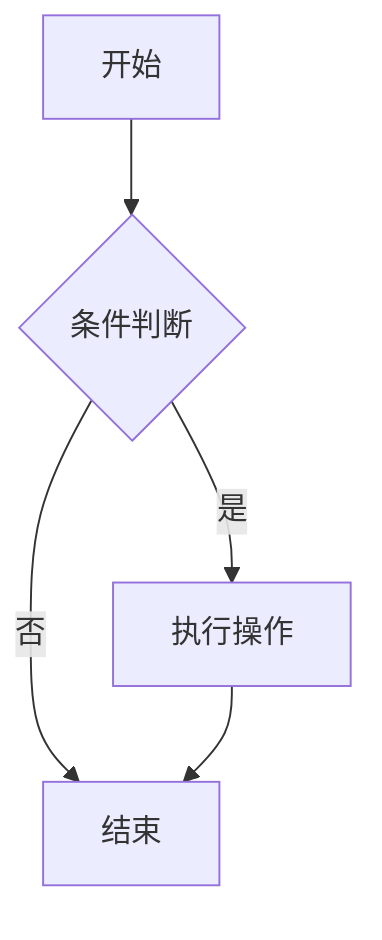

# Mermaid图表渲染问题修复 - 测试指南

## 修复内容

1. **修复了 `MermaidMarkdownExtension` 的异步renderer问题**
   - 将异步renderer改为同步，返回占位符HTML
   - 避免了 `[object Promise]` 问题

2. **改进了资源渲染服务**
   - 添加了详细的调试日志
   - 改进了错误处理
   - 添加了延迟初始化机制

3. **添加了备用渲染方案**
   - 如果AssetRendererService未初始化，会尝试直接使用MermaidRenderer

## 测试步骤

### 1. 清除浏览器缓存/重新启动应用

确保使用最新的代码：
```bash
# 停止当前运行的开发服务器
# 重新启动
npm run dev
# 或
npm run electron:serve
```

### 2. 打开浏览器控制台

按 `F12` 打开开发者工具，查看控制台日志。

### 3. 创建包含Mermaid图表的文档

创建一个新文档，添加以下内容：

````markdown
# 测试文档

这是一个测试Mermaid图表的文档。


````

### 4. 观察预览界面

应该看到：
- ✅ 占位符显示 "🔄 正在渲染Mermaid图表..."
- ✅ 几秒后占位符被替换为渲染好的SVG图表
- ✅ 控制台显示渲染日志

### 5. 保存文档

点击保存或等待自动保存。

### 6. 重新打开文档

关闭并重新打开同一个文档，观察：
- ✅ 预览界面应该显示渲染好的图表
- ✅ 不应该看到 `[object Promise]`
- ✅ 不应该看到占位符（如果之前已经渲染过）

### 7. 检查控制台日志

应该看到类似以下的日志：
```
[AssetRenderer] 找到占位符数量: 1
[AssetRenderer] 开始渲染占位符: mermaid-xxx 代码长度: 50
[AssetRenderer] 调用Mermaid渲染器...
[AssetRenderer] Mermaid渲染成功，SVG长度: 1234
[AssetRenderer] 占位符已替换为渲染结果
[AssetRenderer] 所有占位符渲染完成
```

## 问题排查

### 如果仍然看到 `[object Promise]`

1. **检查控制台错误**
   - 查看是否有JavaScript错误
   - 查看是否有依赖注入错误

2. **检查占位符是否存在**
   - 在预览界面右键 -> 检查元素
   - 查找 `.mermaid-asset-placeholder` 类
   - 检查 `data-diagram` 属性是否存在

3. **检查AssetRendererService是否初始化**
   - 查看控制台是否有 `[ApplicationModule] AssetRenderer依赖设置完成` 日志
   - 查看是否有 `[AssetRenderer] Mermaid渲染器未初始化` 警告

### 如果看到占位符但未渲染

1. **检查MermaidRenderer是否初始化**
   - 查看控制台是否有Mermaid初始化日志
   - 检查是否有Mermaid相关错误

2. **手动触发渲染**
   - 在控制台执行：
   ```javascript
   // 查找占位符
   const placeholders = document.querySelectorAll('.mermaid-asset-placeholder');
   console.log('占位符数量:', placeholders.length);
   
   // 检查data-diagram属性
   placeholders.forEach(p => {
     console.log('占位符ID:', p.getAttribute('data-asset-id'));
     console.log('图表代码:', atob(p.getAttribute('data-diagram')));
   });
   ```

3. **检查Vue组件是否正确调用渲染**
   - 查看 `MarkdownEditor.vue` 是否正确调用了 `triggerRender`
   - 检查 `useAssetRenderer` 是否正确初始化

## 预期行为

### 编辑时
- 输入Mermaid代码块后，预览界面显示占位符
- 几秒后占位符自动替换为渲染好的图表

### 保存后重新打开
- 预览界面直接显示渲染好的图表
- 不再显示占位符或 `[object Promise]`

### 控制台日志
- 应该看到详细的渲染过程日志
- 不应该有错误或警告（除了正常的初始化日志）

## 如果问题仍然存在

请提供以下信息：
1. 浏览器控制台的完整日志
2. 预览界面的HTML结构（右键 -> 检查元素）
3. 文档内容（Markdown源码）
4. 是否有任何JavaScript错误

