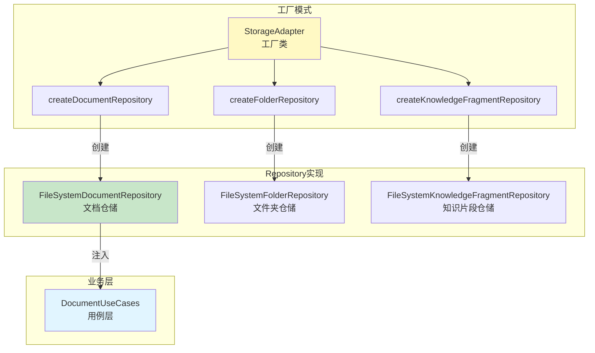
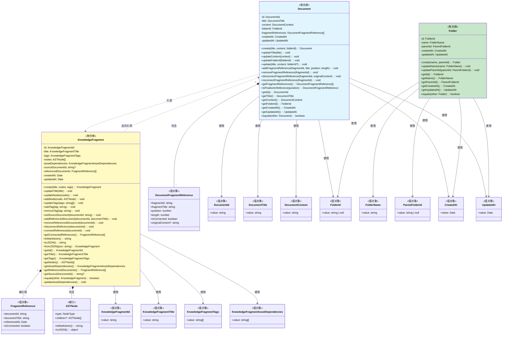
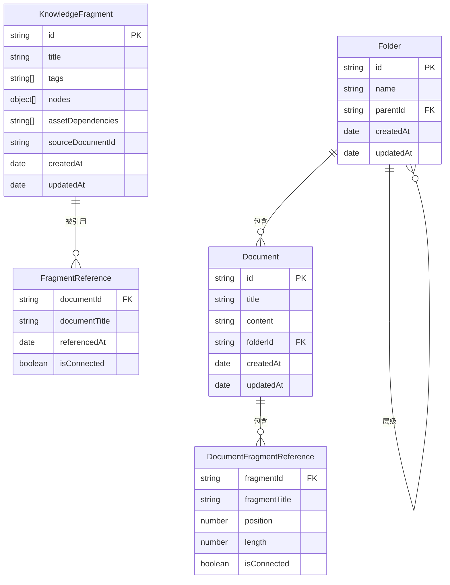
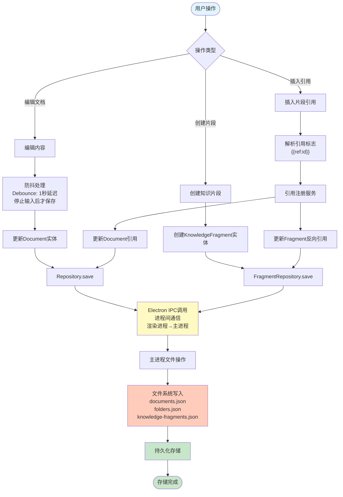
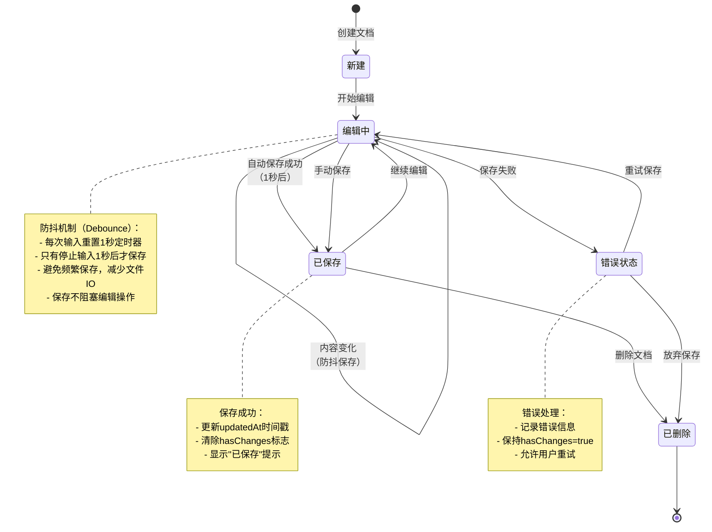
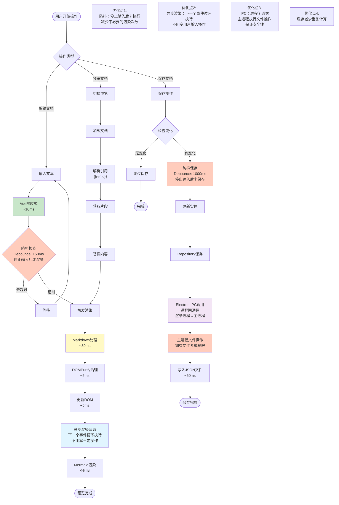

# MDNote 系统设计PPT内容

## 五、数据模型与持久化策略

---

### 5.1 数据存储方案

#### 5.1.1 文件系统存储架构

**核心设计理念**：基于Electron文件系统的本地持久化存储

**存储方案特点**：

| 特性 | 说明 |
|------|------|
| **存储位置** | 用户数据目录（Windows/macOS/Linux） |
| **容量限制** | 无限制，受磁盘空间限制 |
| **性能特点** | 读写速度快，支持大文件，原子性操作（要么完全成功，要么完全失败） |
| **数据格式** | JSON文件 + 资源文件目录结构 |
| **适用场景** | 文档、文件夹、知识片段、资源文件 |

**数据目录位置**：
- **开发环境**：`{userData}/data/`
- **生产环境**：`{appPath}/MDNoteData/`
- **自定义路径**：支持用户指定数据目录

#### 5.1.2 存储工厂模式

**设计模式**：工厂模式（Factory Pattern）

**实现机制**：
- `StorageAdapter` 作为工厂类，统一创建文件系统Repository实例
- 通过静态工厂方法封装对象创建逻辑
- 为依赖注入容器提供统一的Repository实例

**代码架构**：
```typescript
StorageAdapter
├── createDocumentRepository() → FileSystemDocumentRepository
├── createFolderRepository() → FileSystemFolderRepository  
└── createKnowledgeFragmentRepository() → FileSystemKnowledgeFragmentRepository
```

**工厂模式实现**：
```typescript
export class StorageAdapter {
  static createDocumentRepository(): DocumentRepository {
    return new FileSystemDocumentRepository();  // 直接创建文件系统实现
  }

  static createFolderRepository(): FolderRepository {
    return new FileSystemFolderRepository();
  }

  static createKnowledgeFragmentRepository(): KnowledgeFragmentRepository {
    return new FileSystemKnowledgeFragmentRepository();
  }
}
```

**设计优势**：
- **统一创建入口**：所有Repository都通过StorageAdapter创建
- **封装创建逻辑**：客户端代码不需要知道具体实现类
- **易于扩展**：未来如需切换存储实现，只需修改工厂方法
- **依赖注入友好**：便于集成到依赖注入容器中

**工厂模式关系图**：



#### 5.1.3 数据存储目录结构

**文件系统存储结构**：

```
数据目录/
├── documents.json                  # 文档数据文件（所有文档的完整数据）
├── folders.json                    # 文件夹结构文件（层级关系）
├── knowledge-fragments.json        # 知识片段数据文件
├── documents/                      # 文档资源目录
│   └── {documentId}/
│       └── assets/                 # 文档资源文件
│           └── {assetId}.png      # 图片、Mermaid图表等资源
└── fragments/                      # 知识片段资源目录
    └── assets/                     # 片段资源文件
        └── {assetId}/
            └── {imageId}.png
```

**存储文件说明**：

1. **documents.json**：
   - **存储内容**：所有文档的完整数据（包括Markdown内容和元数据）
   - **数据结构**：数组格式，每个元素代表一个文档的完整信息
   - **包含字段**：
     - `id`: 文档唯一标识（UUID）
     - `title`: 文档标题
     - `content`: 完整的Markdown内容（包括所有文本、引用标志等）
     - `folderId`: 所属文件夹ID
     - `createdAt`: 创建时间
     - `updatedAt`: 更新时间
   - **存储方式**：所有文档数据集中存储在一个JSON文件中
   - **文件操作**：通过Electron IPC调用主进程进行读写
   - **数据一致性**：标题和内容都存储在同一个JSON对象中，保证一致性

2. **folders.json**：
   - 存储所有文件夹的层级结构
   - 包含ID、名称、父文件夹ID、时间戳
   - 支持无限层级嵌套

3. **knowledge-fragments.json**：
   - **存储内容**：所有知识片段的完整数据
   - **包含字段**：
     - `id`: 片段唯一标识（UUID）
     - `title`: 片段标题
     - `tags`: 标签数组
     - `nodes`: AST节点结构（完整的内容结构）
     - `assetDependencies`: 资源依赖列表
     - `sourceDocumentId`: 源文档ID
     - `referencedDocuments`: 反向引用列表
     - `createdAt`: 创建时间
     - `updatedAt`: 更新时间
   - **存储方式**：所有片段数据集中存储在一个JSON文件中
   - **支持功能**：标签搜索、引用追踪

**平台数据目录位置**：
- **Windows**: `C:\Users\{用户名}\AppData\Roaming\MDNote\data\`（开发环境）
- **macOS**: `~/Library/Application Support/MDNote/data/`（开发环境）
- **Linux**: `~/.config/MDNote/data/`（开发环境）
- **生产环境**: `{应用安装目录}/MDNoteData/`

**存储特点**：
- **集中式存储**：所有文档的完整数据（包括Markdown内容）存储在`documents.json`中，所有片段的完整数据存储在`knowledge-fragments.json`中
- **数据一致性**：文档的标题和内容存储在同一个JSON对象中，保证标题和内容的一致性
- **资源分离**：文档内容和资源文件分离存储，内容存储在JSON文件中，资源文件（图片、图表等）存储在`documents/{documentId}/assets/`目录
- **原子操作（Atomic Operation）**：通过Electron IPC确保文件写入的原子性。原子操作是指要么完全执行，要么完全不执行，不会出现部分写入的情况，保证数据一致性。实现方式：先写入临时文件，成功后再重命名为正式文件。

---

### 5.2 数据结构

#### 5.2.1 Document（文档）实体结构

**聚合根设计**：
```typescript
Document {
  // 标识
  id: DocumentId (UUID)
  
  // 基本信息
  title: DocumentTitle
  content: DocumentContent (Markdown)
  folderId: FolderId | null
  
  // 引用关系
  fragmentReferences: DocumentFragmentReference[] {
    fragmentId: string
    fragmentTitle: string
    position: number
    length: number
    isConnected: boolean
  }
  
  // 时间戳
  createdAt: Date
  updatedAt: Date
}
```

**存储格式（JSON）**：
```json
[
  {
    "id": "f0c28be4-9693-42f6-ac6f-b7e923bf4e6c",
    "title": "文档标题",
    "content": "# 文档内容\n\n这是完整的Markdown内容，包括所有文本、引用标志等。\n\n{{ref:fragment-id}}\n\n更多内容...",
    "folderId": "folder-id",
    "createdAt": "2025-12-25T00:00:00.000Z",
    "updatedAt": "2025-12-25T00:00:00.000Z"
  },
  {
    "id": "另一个文档ID",
    "title": "另一个文档标题",
    "content": "另一个文档的完整Markdown内容...",
    "folderId": null,
    "createdAt": "2025-12-25T01:00:00.000Z",
    "updatedAt": "2025-12-25T01:00:00.000Z"
  }
]
```

**说明**：
- `documents.json`是一个JSON数组，包含所有文档的完整数据
- 每个文档对象包含完整的Markdown内容（`content`字段），不仅仅是元数据
- 标题和内容存储在同一个对象中，保证数据一致性
- 资源文件（图片等）存储在`documents/{documentId}/assets/`目录，不在JSON文件中

**实际存储实现**：
```typescript
// 保存文档时的实现
async save(document: Document): Promise<void> {
  const documents = await this.getAllDocumentsFromFile();
  const documentData: DocumentData = {
    id: document.getId().value,           // 文档ID
    title: document.getTitle().value,      // 文档标题
    content: document.getContent().value, // 完整的Markdown内容
    folderId: document.getFolderId().value,
    createdAt: document.getCreatedAt().value.toISOString(),
    updatedAt: document.getUpdatedAt().value.toISOString()
  };
  
  // 更新或添加文档到数组
  const existingIndex = documents.findIndex(doc => doc.id === documentData.id);
  if (existingIndex !== -1) {
    documents[existingIndex] = documentData;  // 更新现有文档
  } else {
    documents.push(documentData);            // 添加新文档
  }
  
  // 保存整个数组到文件
  await this.saveDocumentsToFile(documents);
}
```

**数据一致性保证**：
-  **同一对象存储**：标题和内容存储在同一个JSON对象中，更新时同时更新
-  **原子性写入**：整个数组一次性写入，不会出现标题和内容不一致的情况
-  **ID唯一性**：通过文档ID（UUID）唯一标识，确保每个文档的数据对应正确

**核心方法**：
- `create()`: 工厂方法，创建新文档
- `update()`: 更新文档内容
- `addFragmentReference()`: 添加片段引用
- `disconnectFragmentReference()`: 断开引用连接
- `isPositionInReference()`: 检查位置是否在引用区域内

#### 5.2.2 KnowledgeFragment（知识片段）实体结构

**聚合根设计**：
```typescript
KnowledgeFragment {
  // 标识
  id: KnowledgeFragmentId (UUID)
  
  // 基本信息
  title: KnowledgeFragmentTitle
  tags: KnowledgeFragmentTags[]
  
  // 内容结构（AST）
  nodes: ASTNode[] {
    type: 'paragraph' | 'heading' | 'code_block' | 'image' | ...
    content: string
    children?: ASTNode[]
  }
  
  // 资源依赖
  assetDependencies: string[]  // 图片、图表等资源ID
  
  // 引用关系
  sourceDocumentId?: string     // 源文档ID（创建片段时的文档）
  referencedDocuments: FragmentReference[] {
    documentId: string
    documentTitle: string
    referencedAt: Date
    isConnected: boolean
  }
  
  // 时间戳
  createdAt: Date
  updatedAt: Date
}
```

**AST节点类型**：
- `paragraph`: 段落
- `heading`: 标题（h1-h6）
- `list`: 列表
- `code_block`: 代码块
- `image`: 图片
- `mermaid`: Mermaid图表
- `formula`: 数学公式

**核心方法**：
- `create()`: 工厂方法，创建新片段
- `updateNodes()`: 更新AST节点（自动更新资源依赖）
- `addReferencedDocument()`: 添加反向引用
- `getConnectedReferences()`: 获取已连接的引用
- `toMarkdown()`: 转换为Markdown格式
- `fromJSON()`: 从JSON反序列化

#### 5.2.3 Folder（文件夹）实体结构

**聚合根设计**：
```typescript
Folder {
  // 标识
  id: FolderId (UUID)
  
  // 基本信息
  name: FolderName
  parentId: FolderId | null  // 支持层级结构
  
  // 时间戳
  createdAt: Date
  updatedAt: Date
}
```

**存储格式（JSON）**：
```json
{
  "id": "folder-uuid",
  "name": "文件夹名称",
  "parentId": "parent-folder-id",
  "createdAt": "2025-12-25T00:00:00.000Z",
  "updatedAt": "2025-12-25T00:00:00.000Z"
}
```

#### 5.2.4 聚合根类图



**类图说明**：

1. **Document（文档聚合根）**：
   - **核心属性**：ID、标题、内容、文件夹ID、片段引用列表
   - **业务方法**：创建、更新、片段引用管理
   - **值对象**：使用值对象包装基础类型，保证类型安全

2. **KnowledgeFragment（知识片段聚合根）**：
   - **核心属性**：ID、标题、标签、AST节点、资源依赖、反向引用列表
   - **业务方法**：创建、更新、标签管理、引用管理、序列化
   - **AST结构**：内容以AST节点形式存储，支持结构化操作

3. **Folder（文件夹聚合根）**：
   - **核心属性**：ID、名称、父文件夹ID
   - **业务方法**：创建、更新名称、更新父文件夹
   - **层级结构**：通过parentId支持无限层级嵌套

4. **值对象设计**：
   - 所有基础类型都包装为值对象，提供类型安全和语义清晰
   - 值对象是不可变的，保证数据一致性

5. **双向引用关系**：
   - Document通过`fragmentReferences`记录引用的片段（正向引用）
   - KnowledgeFragment通过`referencedDocuments`记录引用它的文档（反向引用）
   - 两个聚合通过引用关系关联，但不直接访问对方的内部状态

#### 5.2.5 数据关系图（ER图）



---

### 5.3 同步与缓存策略

#### 5.3.1 数据同步机制

**双向引用同步**：
- **正向同步**：文档引用片段时，自动在片段中记录引用关系
- **反向同步**：片段更新时，自动通知所有已连接的引用文档
- **断开机制**：用户编辑引用内容后，自动断开连接，不再同步

**同步流程**（FragmentReferenceSyncService）：
1. 片段更新触发 `syncFragmentUpdate(fragmentId)`
2. 获取所有已连接的引用（`isConnected = true`）
3. 遍历每个引用文档（使用异步循环）：
   - 每个文档的同步操作包装在独立的try-catch块中
   - 更新文档中的片段标题信息
   - 保持文档内容中的引用标志 `{{ref:fragmentId}}` 不变
   - 保存文档更新
   - 如果某个文档同步失败，记录错误但继续处理下一个文档
4. 刷新文档预览界面

**错误隔离实现代码**：
```typescript
// 更新每个引用文档
for (const ref of connectedReferences) {
  try {
    // 同步单个文档的操作
    const document = await this.documentRepository.findById({ value: ref.documentId });
    // ... 更新文档 ...
    await this.documentRepository.save(document);
  } catch (error) {
    // 错误隔离：只记录错误，不影响其他文档
    console.error(`Error syncing fragment update to document ${ref.documentId}:`, error);
    // 继续处理下一个文档，不会中断整个同步过程
  }
}
```

**异步处理说明**：
- **方法签名**：`async syncFragmentUpdate()` - 使用async关键字，返回Promise
- **执行方式**：虽然需要按顺序更新多个文档，但使用异步方法执行，不阻塞UI线程
- **用户体验**：用户更新片段后可以立即继续操作，同步在后台异步进行

**同步特点**：
- **只同步已连接引用**：`isConnected = true` 的引用才会同步
- **内容标志保持**：文档内容中保持引用标志，不替换为实际内容
- **异步处理**：使用异步方法（async/await）执行同步操作，不阻塞用户界面
  - **解释**：虽然同步操作需要按顺序更新多个文档（逻辑上是同步的），但使用异步方法执行，不会阻塞用户的其他操作。用户更新片段后可以立即继续编辑，同步在后台进行。
- **错误隔离（Error Isolation）**：单个文档同步失败不影响其他文档
  - **解释**：每个文档的同步操作都包装在独立的try-catch块中。如果某个文档同步失败（如文件不存在、权限问题等），只会记录错误日志，不会中断其他文档的同步过程。这确保了即使部分文档同步失败，其他文档仍能正常同步。

#### 5.3.2 缓存策略

**Mermaid图表渲染缓存**：
- **缓存实现**：使用 `Map<string, MermaidCacheEntry>` 存储
- **缓存键生成**：基于图表内容和渲染选项的base64编码（前32字符）
- **缓存大小限制**：最多100个条目
- **缓存过期时间**：5分钟自动清理过期缓存
- **LRU策略**：超出限制时清理最久未使用的缓存

**缓存实现代码**：
```typescript
private mermaidCache: Map<string, MermaidCacheEntry> = new Map();

private generateCacheKey(diagram: string, options: any): string {
  const optionsStr = JSON.stringify(options);
  return btoa(diagram + optionsStr).substring(0, 32);
}

private cleanupCache(): void {
  const now = Date.now();
  const timeout = 5 * 60 * 1000; // 5分钟
  
  for (const [key, entry] of this.mermaidCache.entries()) {
    if (now - entry.timestamp > timeout) {
      this.mermaidCache.delete(key);
    }
  }
  
  // 如果缓存仍然超过限制，删除最旧的条目
  if (this.mermaidCache.size > 100) {
    const sortedEntries = Array.from(this.mermaidCache.entries())
      .sort((a, b) => a[1].timestamp - b[1].timestamp);
    const toDelete = sortedEntries.slice(0, this.mermaidCache.size - 100);
    toDelete.forEach(([key]) => this.mermaidCache.delete(key));
  }
}
```

**Markdown渲染缓存**：
- 相同内容缓存渲染结果
- 内容变化时自动失效
- 减少重复的Markdown解析和HTML生成

#### 5.3.3 自动保存机制

**防抖保存（Debounce）**：

**防抖概念**：防抖是一种性能优化技术，指在事件被触发后，等待一定时间（延迟时间）内没有再次触发，才执行该事件的处理函数。如果在等待期间再次触发，则重新计时。

**工作原理**：
- 用户每次输入时，都会重置定时器
- 只有在用户停止输入一段时间后（如1秒），才真正执行保存操作
- 这样可以避免频繁的保存操作，减少不必要的文件IO

**防抖保存配置**：
- **延迟时间**：1秒（用户停止输入后）
- **触发条件**：内容或标题变化
- **保存策略**：通过Electron IPC（进程间通信）调用主进程写入文件，主进程拥有文件系统访问权限，保证安全性

**保存流程**：
1. 用户输入触发内容变化
2. 清除之前的定时器（如果存在）
3. 设置新的防抖定时器（1秒）
4. 如果1秒内没有新输入，定时器到期后执行保存
5. 通过 `electronAPI.file.write()` 写入JSON文件
6. 更新保存状态标志（`hasChanges = false`）

**防抖实现代码**：
```typescript
let debounceTimer: number | null = null;

const debouncedSave = () => {
  if (debounceTimer) {
    clearTimeout(debounceTimer);
  }
  
  debounceTimer = setTimeout(() => {
    saveDocument();
  }, 1000);
};
```

---

### 数据流图：从用户操作到持久化存储



---

### 状态机图：文档生命周期状态



---

## 六、非功能性设计

---

### 6.1 性能设计

#### 6.1.1 前端性能优化

**响应式系统优化**：
- **Vue 3响应式**：基于Proxy的高效响应式系统
- **计算属性缓存**：避免重复计算
- **虚拟DOM**：最小化DOM操作

**渲染性能优化**：
- **异步渲染**：预览渲染在下一个事件循环执行，不阻塞用户输入
  - **事件循环（Event Loop）**：JavaScript是单线程语言，通过事件循环机制处理异步操作。事件循环将任务分为同步任务和异步任务，异步任务会被放入任务队列，等待当前同步任务执行完毕后，再从队列中取出执行。使用 `setTimeout` 或 `nextTick` 可以将任务推迟到下一个事件循环执行，从而不阻塞当前操作。
- **防抖处理**：Markdown渲染使用150ms防抖，避免频繁渲染
  - **防抖原理**：用户快速输入时，每次输入都会重置150ms定时器，只有在用户停止输入150ms后才执行渲染，避免每次输入都触发渲染，减少CPU占用。
- **占位符模式**：Mermaid图表异步渲染，不阻塞Markdown处理
  - **占位符**：在Markdown转换为HTML时，先用占位符HTML元素标记Mermaid图表的位置，等DOM渲染完成后再异步将占位符替换为实际渲染的SVG图表。

**性能指标**：

| 操作 | 目标延迟 |  优化措施 |
|------|---------|---------|
| Markdown渲染 | 感觉不到明显延迟  | 150ms防抖 |
| 预览更新 | 感觉不到明显延迟  | 异步渲染 |
| 自动保存 | 不阻塞 |  1000ms防抖延迟 |
| Mermaid渲染 | 不阻塞  | 占位符模式，异步 |

#### 6.1.2 内存优化

**领域对象管理**：
- **值对象轻量化**：使用类型别名而非类实例，减少内存占用
- **DTO转换（Data Transfer Object）**：应用层与领域层之间使用DTO（数据传输对象）进行数据传递，只传递必要的数据字段，避免泄露领域对象的完整引用，便于对象回收。
- **及时释放**：文档使用完后可被GC（垃圾回收器）回收，释放内存

**缓存管理**：
- **缓存大小限制**：Mermaid缓存最多100个条目，防止内存无限增长
- **缓存过期机制**：5分钟自动清理过期缓存，确保缓存数据的新鲜度
- **LRU策略（Least Recently Used）**：当缓存超出限制时，清理最久未使用的缓存条目，保留最近使用的数据，提高缓存命中率

#### 6.1.3 存储性能优化

**批量操作**：
- **批量保存**：多个文档更新时合并写入，减少IO次数
- **异步操作**：所有存储操作异步执行，不阻塞UI线程
- **IPC优化**：通过Electron IPC（进程间通信）批量传输数据，减少进程间通信次数，提升性能

**读写优化**：
- **JSON文件存储**：轻量级数据格式，解析快速，易于维护
- **增量更新**：只更新变化的数据，不重写整个文件，减少IO操作
- **懒加载（Lazy Loading）**：大文档按需加载，不一次性加载所有内容到内存，节省内存占用
- **文件缓存**：读取的文件内容在内存中缓存，减少重复的文件IO操作

**文件操作优化**：
- **Electron IPC（Inter-Process Communication）**：进程间通信机制。渲染进程通过IPC调用主进程进行文件操作，主进程拥有文件系统访问权限，渲染进程没有，这样既保证了安全性，又避免了渲染进程阻塞。
- **错误重试**：文件写入失败时自动重试，提高可靠性
- **异常处理**：完善的错误捕获和用户友好的错误提示

---

### 6.2 安全性设计

#### 6.2.1 XSS防护

**DOMPurify清理**：
- **HTML清理**：所有Markdown渲染后的HTML都经过DOMPurify清理
- **白名单机制**：只允许安全的HTML标签和属性
- **脚本过滤**：自动移除所有JavaScript代码和事件处理器

**实现位置**：
```typescript
// ExtensibleMarkdownProcessor.processMarkdown()
const html = marked(content);
const sanitizedHtml = DOMPurify.sanitize(html);  // XSS防护
return sanitizedHtml;
```

**防护范围**：
-  Markdown内容渲染
-  模板变量替换
-  知识片段内容
-  文档导出内容

#### 6.2.2 内容安全策略（CSP）

**CSP配置**：
```html
<meta http-equiv="Content-Security-Policy" 
      content="default-src 'self'; 
               script-src 'self' 'unsafe-inline' 'unsafe-eval'; 
               style-src 'self' 'unsafe-inline'; 
               img-src 'self' data: file: app:; 
               font-src 'self' data:;">
```

**策略说明**：
- **default-src 'self'**：默认只允许同源资源
- **script-src**：允许内联脚本（Vue需要）和eval（Mermaid需要）
- **img-src**：允许data URI、file协议、app协议（Electron）
- **style-src**：允许内联样式（Vue组件样式）

#### 6.2.3 数据安全

**输入验证**：
- **类型检查**：TypeScript静态类型检查
- **内容验证**：文档标题、内容长度限制
- **格式验证**：UUID格式验证、日期格式验证

**存储安全**：
- **本地存储**：数据存储在用户本地，不上传到服务器
- **文件权限**：Electron环境下遵循操作系统文件权限
- **数据备份**：支持手动导出备份（未来扩展）

**错误处理**：
- **异常捕获**：所有异步操作都有错误处理
- **用户提示**：错误信息用户友好，不泄露技术细节
- **降级策略**：存储失败时保留草稿，允许重试

---

### 6.3 可扩展性设计

#### 6.3.1 架构可扩展性

**分层架构**：
- **依赖倒置**：Domain层定义接口，Infrastructure层实现
- **接口抽象**：Repository接口支持多种实现
- **插件机制**：Markdown扩展机制支持自定义扩展

**存储可扩展性**：
- **存储适配器**：支持新增存储实现（如数据库、云存储）
- **接口抽象**：Repository接口支持多种实现
- **无缝切换**：更换存储实现不影响业务逻辑
- **未来扩展**：可支持SQLite、PostgreSQL等数据库存储

**服务可扩展性**：
- **依赖注入**：使用InversifyJS实现依赖注入
- **服务接口**：所有服务都通过接口定义
- **实现替换**：可以轻松替换服务实现

#### 6.3.2 功能可扩展性

**Markdown扩展机制**：
```typescript
interface MarkdownExtension {
  name: string;
  priority: number;
  preProcess?: (content: string) => string;
  postProcess?: (html: string) => string;
}

// 注册扩展
markdownProcessor.registerExtension({
  name: 'custom-extension',
  priority: 100,
  preProcess: (content) => { /* ... */ },
  postProcess: (html) => { /* ... */ }
});
```

**变量解析器扩展**：
```typescript
interface VariableResolver {
  resolve(variableName: string, context: any): Promise<string>;
}

// 注册自定义变量解析器
templateProcessor.registerVariableResolver('customVar', new CustomResolver());
```

**资源类型扩展**：
- 支持新增资源类型（如视频、音频）
- 统一的资源管理接口
- 可插拔的资源渲染器

#### 6.3.3 数据模型可扩展性

**实体扩展**：
- **值对象模式**：便于添加验证逻辑
- **聚合根设计**：业务逻辑集中在聚合内
- **版本兼容**：数据结构支持向后兼容

---

### 部署图：Electron应用跨平台部署架构

```mermaid
graph TB
    subgraph "Windows平台"
        WinApp[MDNote.exe<br/>Electron应用]
        WinFS[Windows文件系统<br/>C:\Users\...\MDNote\data\]
        WinAPI[Windows API<br/>文件操作/系统集成]
    end
    
    subgraph "macOS平台"
        MacApp[MDNote.app<br/>Electron应用]
        MacFS[macOS文件系统<br/>~/Library/Application Support/MDNote/data/]
        MacAPI[macOS API<br/>文件操作/系统集成]
    end
    
    subgraph "Linux平台"
        LinuxApp[MDNote<br/>Electron应用]
        LinuxFS[Linux文件系统<br/>~/.config/MDNote/data/]
        LinuxAPI[Linux API<br/>文件操作/系统集成]
    end
    
    subgraph "应用核心层"
        Core[应用核心<br/>Vue 3 + TypeScript]
        Domain[领域层<br/>业务逻辑]
        Infra[基础设施层<br/>存储适配器]
    end
    
    subgraph "存储抽象层"
        StorageAdapter[StorageAdapter<br/>统一存储接口]
        FSRepo[FileSystemRepository<br/>文件系统实现]
    end
    
    subgraph "Electron主进程"
        MainProcess[主进程<br/>文件系统操作]
        IPC[IPC通信<br/>渲染进程↔主进程]
    end
    
    WinApp --> Core
    MacApp --> Core
    LinuxApp --> Core
    
    Core --> Domain
    Domain --> Infra
    Infra --> StorageAdapter
    
    StorageAdapter --> FSRepo
    FSRepo --> IPC
    IPC --> MainProcess
    
    MainProcess --> WinFS
    MainProcess --> MacFS
    MainProcess --> LinuxFS
    
    WinApp --> WinAPI
    MacApp --> MacAPI
    LinuxApp --> LinuxAPI
    
    style WinApp fill:#0078d4
    style MacApp fill:#000000
    style LinuxApp fill:#fcc624
    style StorageAdapter fill:#fff9c4
    style Core fill:#42b883
    style IPC fill:#f3e5f5
    style MainProcess fill:#ffccbc
```



**部署说明**：
- **跨平台支持**：Windows、macOS、Linux三个平台
- **统一核心**：应用核心代码完全一致，使用Electron框架
- **平台适配**：通过StorageAdapter统一文件系统接口，自动适配不同平台
- **数据隔离**：每个平台使用独立的用户数据目录，数据互不干扰
- **文件系统**：所有数据存储在本地文件系统，支持大文件和资源文件
- **IPC通信（Inter-Process Communication）**：进程间通信机制。渲染进程通过IPC调用主进程进行文件操作，主进程拥有文件系统访问权限，渲染进程没有，这样既保证了安全性，又避免了渲染进程阻塞。

---

### 活动图：用户操作的性能关键路径和优化点



**性能优化点说明**：

1. **防抖优化**（150ms）：
   - **原理**：用户输入时重置定时器，只有停止输入150ms后才执行渲染
   - **效果**：减少Markdown渲染次数，避免用户快速输入时的频繁渲染
   - **收益**：降低CPU占用，提升整体响应速度

2. **异步渲染**：
   - **事件循环机制**：使用 `nextTick` 或 `setTimeout` 将渲染任务推迟到下一个事件循环
   - **占位符模式**：Mermaid图表先用占位符标记，DOM渲染完成后再异步替换为实际图表
   - **效果**：不阻塞Markdown处理，预览界面快速显示，图表逐步加载
   - **收益**：提升用户体验，避免界面卡顿

3. **IPC通信（Inter-Process Communication）**：
   - **进程间通信**：Electron应用分为主进程和渲染进程，IPC是它们之间的通信桥梁
   - **安全性**：文件操作通过主进程执行，渲染进程没有直接文件系统访问权限，保证安全性
   - **性能**：避免渲染进程直接操作文件系统，支持异步操作，不阻塞UI线程

4. **缓存机制**：
   - Mermaid渲染结果缓存
   - 相同内容不重复处理
   - 减少计算开销

