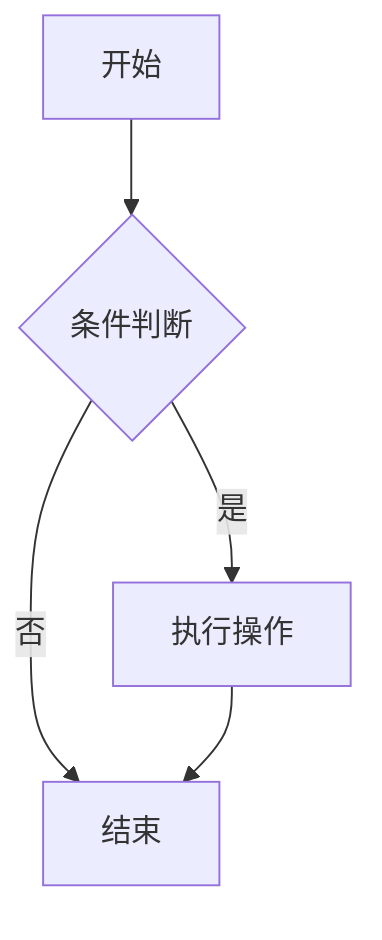

# 知枢（Zhishu）

一个现代化的 Markdown 知识管理应用，基于 Vue 3 和 Electron 构建，提供本地文件系统存储和强大的编辑功能。


## ✨ 特性

- **📝 强大的 Markdown 编辑** - 支持实时预览和语法高亮
- **🔬 数学公式支持** - 集成 KaTeX 渲染数学表达式
- **📊 图表绘制** - 内置 Mermaid 图表支持
- **📁 文件夹管理** - 完整的文件夹创建、重命名和删除功能
- **💾 本地存储** - 基于 Electron 的本地文件系统存储
- **📄 文档导出** - 支持 Html与Pdf 格式导出
- **🔒 数据安全** - DOMPurify XSS 防护和内容过滤
- **🌙 现代界面** - 响应式设计和用户友好的界面
- **⚡ 高性能** - 基于现代前端技术栈的快速响应
- **🧠 知识片段管理** - 支持知识片段的创建、分类、推荐和引用
- **🕸️ 知识图谱** - 可视化知识关联，支持节点跳转和布局调整
- **💚 知识健康度** - 自动检测知识片段的引用情况，评估健康状态

## 🛠️ 技术栈

### 前端

- **Vue 3.5.12** - 渐进式 JavaScript 框架
- **Vue Router 4.6.4** - 官方路由管理器
- **Vite 5.4.8** - 现代前端构建工具
- **TypeScript 5.6.2** - 类型安全的 JavaScript 超集

### 后端/桌面

- **Electron 30.0.0** - 跨平台桌面应用框架
- **Node.js 20+** - JavaScript 运行时

### 核心功能库

- **Marked 17.0.1** - Markdown 解析器
- **KaTeX 0.16.11** - 数学公式渲染引擎
- **Mermaid 11.4.1** - 图表绘制库
- **DOMPurify 3.3.1** - HTML 清理和 XSS 防护
- **Docxtemplater 3.67.5** - Word 文档生成

### 开发和测试

- **Vitest 2.1.4** - 单元测试框架
- **Playwright 1.49.0** - 端到端测试框架
- **ESLint 9.13.0** - 代码质量检查
- **Prettier 3.3.3** - 代码格式化

## 📋 项目结构

```
MDNote/
├── src/
│   ├── domain/                 # 领域层 - 业务逻辑
│   │   ├── entities/          # 实体
│   │   ├── repositories/      # 仓储接口
│   │   ├── services/          # 领域服务
│   │   └── types/             # 类型定义
│   ├── application/           # 应用层 - 应用逻辑
│   │   ├── dto/               # 数据传输对象
│   │   ├── services/          # 应用服务
│   │   └── usecases/          # 用例
│   ├── infrastructure/        # 基础设施层 - 技术实现
│   │   └── repositories/      # 仓储实现
│   └── presentation/          # 表现层 - UI 和交互
│       ├── components/        # Vue 组件
│       ├── composables/       # Vue 组合式函数
│       └── router/            # 路由配置
├── e2e/                       # 端到端测试
│   ├── electron/              # Electron 应用测试
│   └── vue.spec.ts            # Web 浏览器测试
├── public/                    # 静态资源
├── main.js                    # Electron 主进程
└── dist/                      # 构建输出
```

## 🚀 快速开始

### 环境要求

- Node.js >= 20.0.0
- npm 或 yarn

### 安装依赖

```bash
# 克隆项目
git clone <repository-url>
cd MDNote

# 安装依赖
npm install
```

### 开发模式

```bash
# 启动开发服务器 (仅前端)
npm run dev

# 启动 Electron 应用 (完整开发环境)
npm run electron:serve
```

### 构建应用

```bash
# 构建前端资源
npm run build

# 预览构建结果
npm run preview

# 构建 Electron 应用
npm run electron:build
```

## 🧪 测试

### 单元测试

```bash
# 运行单元测试
npm run test:unit
```

### 端到端测试

```bash
# Web 浏览器测试
npm run test:e2e

# Electron 应用测试
npm run test:electron
```

### 测试覆盖率

```bash
# 生成测试覆盖率报告
npm run test:unit -- --coverage
```

## 📖 核心功能

### Markdown 编辑

- **实时预览** - 左右分屏显示源码和渲染结果
- **语法高亮** - 支持代码块语法高亮
- **自动保存** - 文档内容自动保存到本地
- **快捷键** - 支持常用 Markdown 快捷键

### 数学公式

支持 KaTeX 数学公式渲染：

```markdown
行内公式：$E = mc^2$

块级公式：

$$
\int_{-\infty}^{\infty} e^{-x^2} dx = \sqrt{\pi}
$$
```

### 图表绘制

内置 Mermaid 图表支持：

````markdown

````

### 文件夹管理

- 创建、重命名、删除文件夹
- 文件夹层级导航
- 文件拖拽移动
- 文件夹搜索和过滤

### 文档导出

支持导出为 Word 文档 (.docx) 格式，保持格式和样式。

### 知识片段管理

- **片段创建** - 将文档中的内容提取为可复用的知识片段
- **分类体系** - 支持多级分类管理知识片段
- **智能推荐** - 基于标签、关键词、分类等多维度推荐相关片段
- **引用关联** - 支持在文档中引用知识片段，建立知识关联图谱
- **片段健康度** - 自动检测片段的引用情况，标识孤立片段

### 知识图谱

- **可视化展示** - 以节点和边的形式展示知识片段之间的关联
- **节点跳转** - 点击图谱节点可直接跳转到对应文档或知识片段
- **布局调整** - 支持手动调整节点位置，自动保存布局
- **导入导出** - 可将图谱保存为独立的 JSON 文件

### 知识健康度

- **健康评分** - 从引用数、关联度等维度综合评估片段健康状态
- **风险标识** - 自动标识孤立片段、未被引用片段等风险项
- **影响分析** - 分析删除或修改片段对其他知识的影响
- **批量检测** - 支持批量检测整个知识库的健康状况

## 🏗️ 架构设计

项目采用 **领域驱动设计 (DDD)** 架构，分为三个主要层次：

### 1. 领域层 (Domain Layer)

- 包含核心业务逻辑和业务规则
- 定义实体、值对象和聚合根
- 提供领域服务和仓储接口

### 2. 应用层 (Application Layer)

- 协调领域对象完成应用程序功能
- 实现用例和业务流程
- 处理事务和外部接口

### 3. 基础设施层 (Infrastructure Layer)

- 提供技术实现细节
- 实现仓储接口和外部服务集成
- 处理数据持久化和通信

## 🔄 开发工作流

### 1. 功能开发

```bash
# 创建新的功能分支
git checkout -b feature/new-feature

# 开发和测试
npm run electron:serve
npm run test:unit
npm run test:electron

# 提交代码
git add .
git commit -m "feat: 添加新功能"
git push origin feature/new-feature
```

### 2. 代码质量

```bash
# 代码检查
npm run lint

# 代码格式化
npm run format

# 类型检查
npm run type-check
```

### 3. 构建和部署

```bash
# 构建生产版本
npm run electron:build

# 安装包位于 release/ 目录
```

## 🔧 配置说明

### Electron 配置

主要配置文件：`main.js`

- 窗口大小和行为设置
- 开发模式配置
- IPC 通信处理

### Vite 配置

主要配置文件：`vite.config.ts`

- 开发服务器设置
- 构建优化配置
- 插件配置

### 测试配置

- `playwright.config.ts` - Web 浏览器测试配置
- `playwright.electron.config.ts` - Electron 应用测试配置
- `vitest.config.ts` - 单元测试配置

## 🐛 故障排除

### 常见问题

1. **Electron 应用无法启动**

   ```bash
   # 确保依赖已正确安装
   npm install

   # 清理缓存
   npm run clean
   npm install
   ```

2. **开发服务器端口冲突**

   ```bash
   # 修改 Vite 配置中的端口
   # 或停止占用端口的其他应用
   ```

3. **构建失败**

   ```bash
   # 检查 Node.js 版本
   node --version  # 应该 >= 20.0.0

   # 清理 node_modules 重新安装
   rm -rf node_modules package-lock.json
   npm install
   ```

### 调试技巧

1. **Electron 开发工具**
   - 开发模式下自动打开 DevTools
   - 可以检查渲染进程和主进程

2. **Vue 开发工具**
   - 集成 Vue DevTools 浏览器扩展
   - 支持组件状态检查和调试

3. **日志调试**
   - 使用 `console.log` 进行基础调试
   - Electron 主进程日志会显示在控制台

## 🤝 贡献指南

我们欢迎所有形式的贡献！请遵循以下步骤：

### 1. 报告问题

- 使用 GitHub Issues 报告 bug
- 提供详细的复现步骤和环境信息
- 包含相关的错误日志和截图

### 2. 提交功能

1. Fork 项目
2. 创建功能分支：`git checkout -b feature/your-feature`
3. 提交更改：`git commit -m 'feat: 添加新功能'`
4. 推送分支：`git push origin feature/your-feature`
5. 创建 Pull Request

### 3. 代码规范

- 遵循 ESLint 和 Prettier 配置
- 编写有意义的提交信息
- 为新功能添加测试用例
- 更新相关文档

### 4. 提交信息规范

使用约定式提交格式：

```
<type>[optional scope]: <description>

[optional body]

[optional footer(s)]
```

类型包括：

- `feat`: 新功能
- `fix`: 修复 bug
- `docs`: 文档更新
- `style`: 代码格式化
- `refactor`: 代码重构
- `test`: 测试相关
- `chore`: 构建或辅助工具变动

## 💻 IDE 推荐

### VS Code

推荐安装以下扩展：

- [Vue (Official)](https://marketplace.visualstudio.com/items?itemName=Vue.volar)
- [TypeScript Vue Plugin (Volar)](https://marketplace.visualstudio.com/items?itemName=Vue.vscode-typescript-vue-plugin)
- [ESLint](https://marketplace.visualstudio.com/items?itemName=dbaeumer.vscode-eslint)
- [Prettier](https://marketplace.visualstudio.com/items?itemName=esbenp.prettier-vscode)

### 浏览器开发工具

- **Vue.js devtools** - 用于 Vue 应用调试
- **React Developer Tools** - 如果需要调试 React 组件


## 🙏 致谢

感谢以下开源项目的支持：

- [Vue.js](https://vuejs.org/) - 渐进式 JavaScript 框架
- [Electron](https://www.electronjs.org/) - 跨平台桌面应用框架
- [Marked](https://marked.js.org/) - Markdown 解析器
- [KaTeX](https://katex.org/) - 数学公式渲染引擎
- [Mermaid](https://mermaid-js.github.io/) - 图表绘制库
- [Playwright](https://playwright.dev/) - 端到端测试框架

## 📞 联系方式

- 项目主页：[[GitHub Repository](https://github.com/WJiongzhaO/MDNote)]
- 邮箱：[2353819@tongji.edu.cn]

---

**Happy Coding! 🎉**
