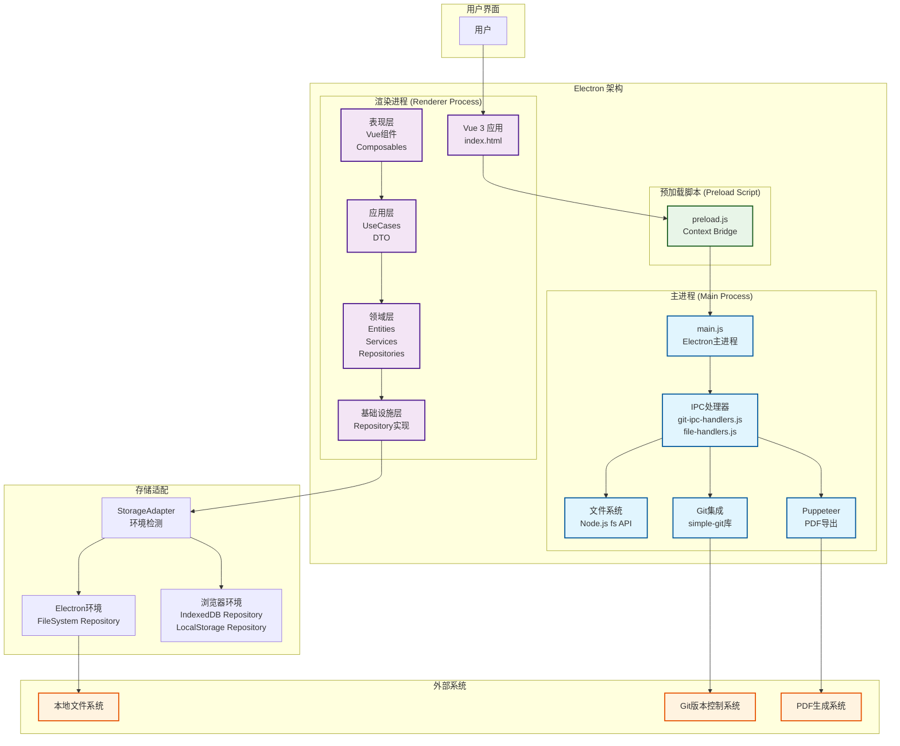
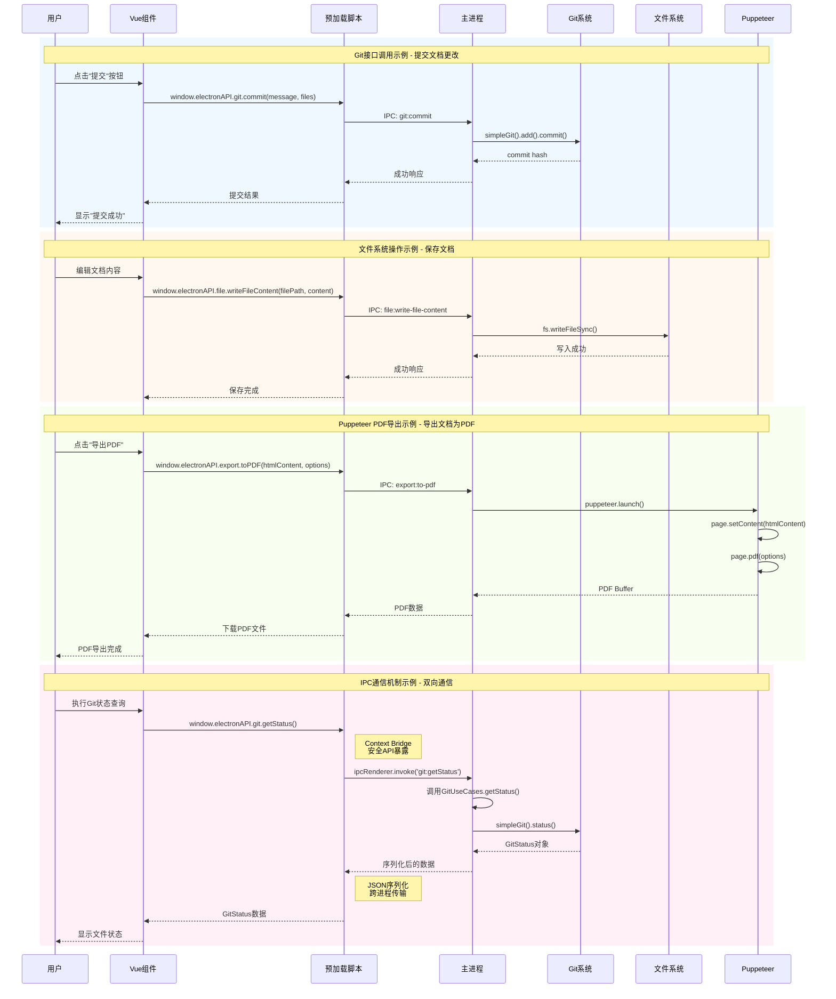
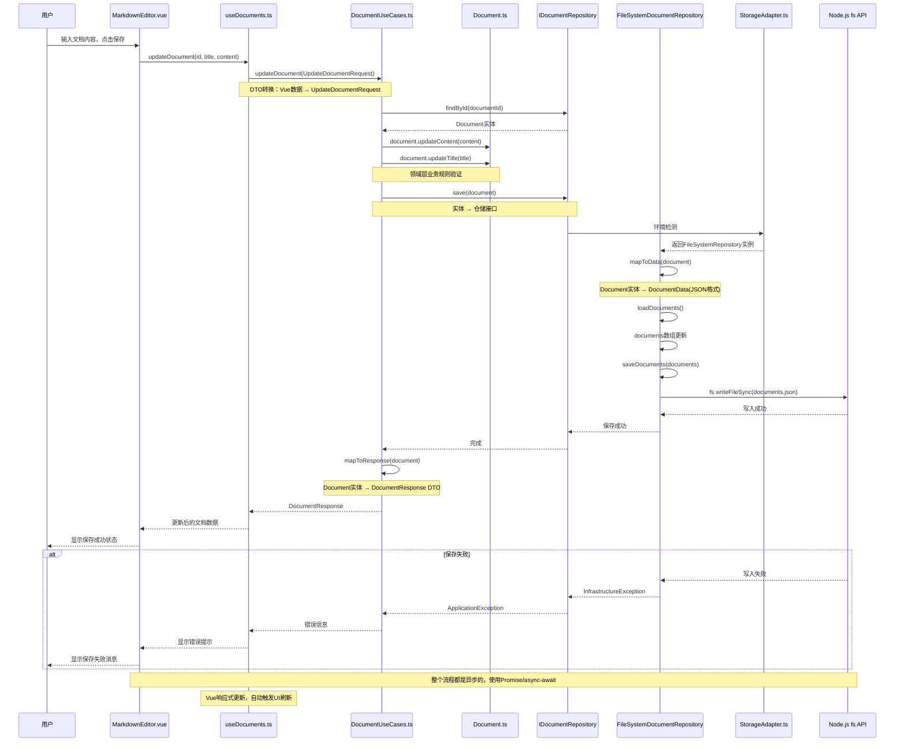
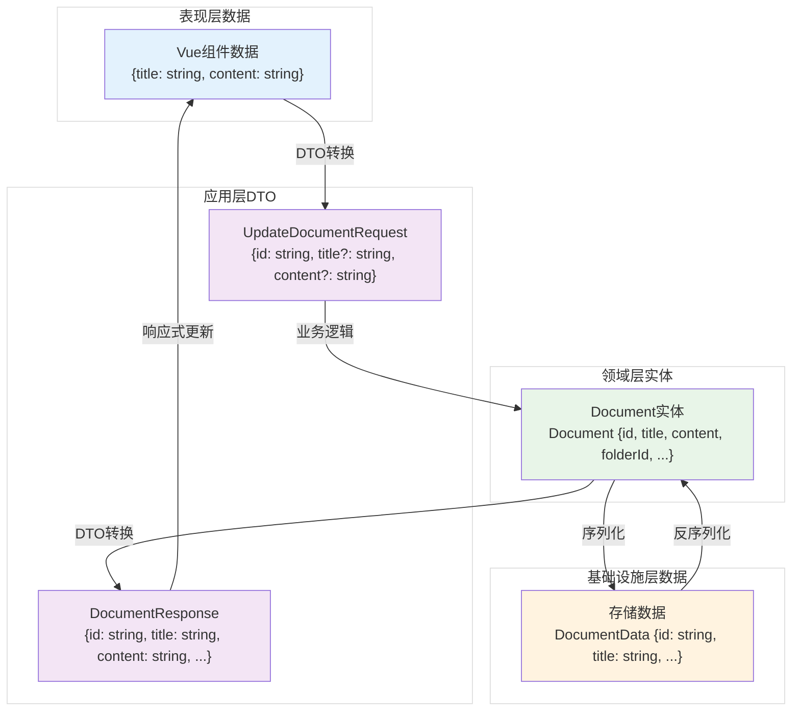

# SDD文档 Section 2: 架构与接口设计大纲

## 目录
- [2.a 平台相关架构](#2a-平台相关架构)
- [2.b 子系统及接口列表](#2b-子系统及接口列表)
- [2.c 外部系统接口规范](#2c-外部系统接口规范)
- [2.d 子系统接口详细设计](#2d-子系统接口详细设计)

---

## 2.a 平台相关架构

### 2.a.1 运行环境架构

#### Electron 桌面应用架构
- **主进程（Main Process）**
  - 文件系统访问（Node.js fs模块）
  - IPC通信处理
  - 窗口管理
  - 系统级API调用
  
- **渲染进程（Renderer Process）**
  - Vue 3应用运行环境
  - 浏览器API访问
  - UI渲染和交互

- **预加载脚本（Preload Script）**
  - Context Bridge安全通信
  - API暴露和权限控制

#### 浏览器Web应用架构（可选）
- 纯浏览器环境运行
- IndexedDB/LocalStorage存储
- 受限的文件系统访问

### 2.a.2 平台差异处理

#### 存储适配策略
- **Electron环境**：文件系统存储（FileSystemRepository）
- **浏览器环境**：IndexedDB/LocalStorage存储
- **适配器模式**：StorageAdapter自动检测环境并选择实现

#### 平台特定功能
- Electron：完整文件系统访问、Git集成、Puppeteer PDF导出
- 浏览器：受限存储、无文件系统直接访问

### 2.a.3 架构图

**配套模型1：平台架构图**
- 展示主进程、渲染进程、预加载脚本的关系
- 展示不同平台下的存储适配机制
- 展示IPC通信流程



**图表解释**：
1. **Electron架构**：展示主进程（Node.js环境）、渲染进程（浏览器环境）和预加载脚本（安全通信桥梁）的关系
2. **进程间通信**：渲染进程通过预加载脚本的安全API与主进程进行IPC通信
3. **存储适配**：StorageAdapter根据运行环境自动选择不同的存储实现
4. **外部系统集成**：通过主进程集成Git、文件系统和PDF导出功能

---

## 2.b 子系统及接口列表

### 2.b.1 分层架构子系统

#### Presentation Layer（表现层）
**职责**：用户界面展示和交互

**主要子系统**：

1. **UI组件子系统**
   - **MarkdownEditor组件**：主要的文档编辑器，支持实时预览、语法高亮、自动保存
   - **FileExplorer组件**：文件浏览器，展示文档和文件夹的树形结构
   - **KnowledgeFragmentSidebar组件**：知识片段侧边栏，管理可复用的内容块
   - **GitPanel组件**：Git版本控制面板，提供提交、历史记录、差异对比等功能
   - **MermaidEditor组件**：Mermaid图表编辑器，支持流程图、时序图等图表类型
   - **FormulaEditor组件**：数学公式编辑器，支持KaTeX格式的公式输入和预览

2. **Composables子系统**
   - **useDocuments**：文档管理组合式函数，处理文档的CRUD操作
   - **useFolders**：文件夹管理组合式函数，处理文件夹的树形结构操作
   - **useKnowledgeFragments**：知识片段管理组合式函数，处理片段的复用和引用
   - **useGit**：Git版本控制组合式函数，封装Git操作的响应式接口
   - **useAssetRenderer**：资源渲染组合式函数，异步渲染Mermaid图表等资源
   - **useImageUpload**：图片上传组合式函数，处理图片的上传和存储

3. **路由子系统**
   - **Vue Router配置**：应用路由配置，管理页面导航
   - **路由守卫和导航**：路由权限控制和导航逻辑

**接口**：
- 组件Props接口
- Composables返回值接口
- 事件发射接口

#### Application Layer（应用层）
**职责**：用例编排和业务流程协调

**主要子系统**：

1. **用例子系统**
   - **DocumentUseCases**：文档业务用例，封装文档的创建、编辑、删除、查询等业务逻辑
   - **FolderUseCases**：文件夹业务用例，处理文件夹的树形结构管理
   - **KnowledgeFragmentUseCases**：知识片段业务用例，管理可复用的内容片段
   - **GitUseCases**：Git版本控制用例，封装Git操作的业务逻辑
   - **VariableUseCases**：变量系统用例，处理模板变量的解析和管理

2. **DTO子系统**
   - **DocumentDTO**：文档数据传输对象，定义文档相关的数据结构
   - **FolderDTO**：文件夹数据传输对象，定义文件夹的数据格式
   - **KnowledgeFragmentDTO**：知识片段数据传输对象，定义片段的数据结构
   - **GitDTO**：Git数据传输对象（CommitDTO, DiffDTO, StatusDTO），定义Git操作的数据格式
   - **VariableDTO**：变量数据传输对象，定义变量相关的数据结构

3. **应用服务子系统**
   - **ApplicationService**：应用服务协调器，负责应用的启动、配置和各模块的初始化

**接口**：
- UseCases公共方法接口
- DTO类型定义
- 应用服务接口

#### Domain Layer（领域层）
**职责**：核心业务逻辑和业务规则

**主要子系统**：

1. **实体子系统**
   - **Document实体**：文档聚合根，封装文档的核心业务逻辑和数据
   - **Folder实体**：文件夹聚合根，管理文件夹的树形结构和关系
   - **KnowledgeFragment实体**：知识片段聚合根，管理可复用的内容片段
   - **Git实体**：Git相关实体（GitCommit, GitStatus, GitDiff），定义Git操作的数据模型

2. **仓储接口子系统**
   - **IDocumentRepository**：文档仓储接口，定义文档的持久化操作抽象
   - **IFolderRepository**：文件夹仓储接口，定义文件夹的持久化操作抽象
   - **IKnowledgeFragmentRepository**：知识片段仓储接口，定义片段的持久化操作抽象
   - **IGitRepository**：Git仓储接口，定义Git版本控制操作的抽象

3. **领域服务子系统**
   - **MarkdownProcessor**：Markdown处理器，处理Markdown到HTML的转换
   - **TemplateProcessor**：模板处理器，支持变量替换和条件渲染
   - **AssetRenderer**：资源渲染器，异步渲染Mermaid图表等资源
   - **MermaidRenderer**：Mermaid图表渲染器，专门处理图表渲染
   - **MathRenderer（KaTeX）**：数学公式渲染器，使用KaTeX渲染数学公式
   - **VariableResolver**：变量解析器，支持可扩展的变量解析机制

**接口**：
- 实体类公共方法接口
- Repository接口定义
- Domain Service接口定义

#### Infrastructure Layer（基础设施层）
**职责**：技术实现和外部依赖

**主要子系统**：

1. **仓储实现子系统**
   - **FileSystemDocumentRepository**：基于文件系统的文档仓储实现（Electron环境）
   - **IndexedDBDocumentRepository**：基于IndexedDB的文档仓储实现（浏览器环境）
   - **LocalStorageDocumentRepository**：基于LocalStorage的文档仓储实现（轻量级存储）
   - **FileSystemFolderRepository**：基于文件系统的文件夹仓储实现
   - **FileSystemKnowledgeFragmentRepository**：基于文件系统的知识片段仓储实现
   - **SimpleGitRepository / ElectronGitRepository**：Git仓储实现，支持版本控制操作

2. **存储适配子系统**
   - **StorageAdapter**：存储适配器，根据运行环境自动选择合适的仓储实现

3. **外部服务集成子系统**
   - **Git服务集成（simple-git）**：集成simple-git库，提供Git版本控制功能
   - **PDF导出服务（Puppeteer）**：集成Puppeteer，实现HTML到PDF的转换
   - **文件系统服务（Electron fs API）**：封装Electron的文件系统API，提供安全的文件操作

**接口**：
- Repository实现类接口
- 存储适配器接口
- 外部服务封装接口

### 2.b.2 子系统接口图

**配套模型2：子系统接口图**
- 展示四层架构中各子系统
- 展示子系统间的依赖关系
- 展示接口调用方向

```mermaid
graph TD
    subgraph "Presentation Layer<br/>表现层"
        subgraph "UI Components<br/>UI组件"
            MarkdownEditor[MarkdownEditor.vue]
            FileExplorer[FileExplorer.vue]
            KnowledgeFragmentSidebar[KnowledgeFragmentSidebar.vue]
            GitPanel[GitPanel.vue]
            MermaidEditor[MermaidEditor.vue]
            FormulaEditor[FormulaEditor.vue]
        end

        subgraph "Composables<br/>组合式函数"
            useDocuments[useDocuments.ts]
            useFolders[useFolders.ts]
            useKnowledgeFragments[useKnowledgeFragments.ts]
            useGit[useGit.ts]
            useAssetRenderer[useAssetRenderer.ts]
        end

        subgraph "Router<br/>路由"
            VueRouter[Vue Router]
        end
    end

    subgraph "Application Layer<br/>应用层"
        subgraph "Use Cases<br/>用例"
            DocumentUseCases[DocumentUseCases.ts]
            FolderUseCases[FolderUseCases.ts]
            KnowledgeFragmentUseCases[KnowledgeFragmentUseCases.ts]
            GitUseCases[GitUseCases.ts]
        end

        subgraph "DTOs<br/>数据传输对象"
            DocumentDTO[DocumentDTO.ts]
            FolderDTO[FolderDTO.ts]
            GitDTO[GitDTO<br/>CommitDTO<br/>DiffDTO<br/>StatusDTO]
        end

        subgraph "Services<br/>应用服务"
            ApplicationService[ApplicationService.ts]
        end
    end

    subgraph "Domain Layer<br/>领域层"
        subgraph "Entities<br/>实体"
            Document[Document.ts]
            Folder[Folder.ts]
            KnowledgeFragment[KnowledgeFragment.ts]
            GitEntities[Git Entities<br/>GitCommit<br/>GitStatus<br/>GitDiff]
        end

        subgraph "Repository Interfaces<br/>仓储接口"
            IDocumentRepository[IDocumentRepository.ts]
            IFolderRepository[IFolderRepository.ts]
            IKnowledgeFragmentRepository[IKnowledgeFragmentRepository.ts]
            IGitRepository[IGitRepository.ts]
        end

        subgraph "Domain Services<br/>领域服务"
            MarkdownProcessor[MarkdownProcessor.ts]
            TemplateProcessor[TemplateProcessor.ts]
            AssetRenderer[AssetRenderer.ts]
            MermaidRenderer[MermaidRenderer.ts]
            MathRenderer[MathRenderer.ts]
            VariableResolver[VariableResolver.ts]
        end
    end

    subgraph "Infrastructure Layer<br/>基础设施层"
        subgraph "Repository Implementations<br/>仓储实现"
            FileSystemDocumentRepo[FileSystemDocumentRepository.ts]
            IndexedDBDocumentRepo[IndexedDBDocumentRepository.ts]
            LocalStorageDocumentRepo[LocalStorageDocumentRepository.ts]
            FileSystemFolderRepo[FileSystemFolderRepository.ts]
            SimpleGitRepository[SimpleGitRepository.ts]
            ElectronGitRepository[ElectronGitRepository.ts]
        end

        subgraph "Storage Adapter<br/>存储适配器"
            StorageAdapter[StorageAdapter.ts]
        end

        subgraph "External Services<br/>外部服务"
            GitIntegration[Git集成<br/>simple-git]
            FileSystem[文件系统<br/>Electron fs]
            PuppeteerIntegration[Puppeteer<br/>PDF导出]
        end
    end

    %% 依赖关系 - 表现层依赖应用层
    MarkdownEditor --> useDocuments
    FileExplorer --> useFolders
    KnowledgeFragmentSidebar --> useKnowledgeFragments
    GitPanel --> useGit
    MermaidEditor --> useAssetRenderer
    FormulaEditor --> useAssetRenderer

    useDocuments --> DocumentUseCases
    useFolders --> FolderUseCases
    useKnowledgeFragments --> KnowledgeFragmentUseCases
    useGit --> GitUseCases
    useAssetRenderer --> DocumentUseCases

    %% 应用层依赖领域层
    DocumentUseCases --> DocumentDTO
    DocumentUseCases --> IDocumentRepository
    DocumentUseCases --> MarkdownProcessor

    FolderUseCases --> FolderDTO
    FolderUseCases --> IFolderRepository

    KnowledgeFragmentUseCases --> IKnowledgeFragmentRepository

    GitUseCases --> GitDTO
    GitUseCases --> IGitRepository

    ApplicationService --> DocumentUseCases

    %% 领域层内部依赖
    Document --> IDocumentRepository
    Folder --> IFolderRepository
    KnowledgeFragment --> IKnowledgeFragmentRepository

    MarkdownProcessor --> TemplateProcessor
    MarkdownProcessor --> AssetRenderer
    AssetRenderer --> MermaidRenderer
    AssetRenderer --> MathRenderer
    TemplateProcessor --> VariableResolver

    %% 基础设施层实现接口
    FileSystemDocumentRepo --> IDocumentRepository
    IndexedDBDocumentRepo --> IDocumentRepository
    LocalStorageDocumentRepo --> IDocumentRepository
    FileSystemFolderRepo --> IFolderRepository
    SimpleGitRepository --> IGitRepository
    ElectronGitRepository --> IGitRepository

    StorageAdapter --> FileSystemDocumentRepo
    StorageAdapter --> IndexedDBDocumentRepo
    StorageAdapter --> LocalStorageDocumentRepo

    GitIntegration --> SimpleGitRepository
    GitIntegration --> ElectronGitRepository
    FileSystem --> FileSystemDocumentRepo
    FileSystem --> FileSystemFolderRepo
    PuppeteerIntegration --> DocumentUseCases

    %% 样式定义
    classDef presentation fill:#e3f2fd,stroke:#1565c0,stroke-width:2px
    classDef application fill:#f3e5f5,stroke:#6a1b9a,stroke-width:2px
    classDef domain fill:#e8f5e8,stroke:#2e7d32,stroke-width:2px
    classDef infrastructure fill:#fff3e0,stroke:#f57c00,stroke-width:2px

    class MarkdownEditor,FileExplorer,KnowledgeFragmentSidebar,GitPanel,MermaidEditor,FormulaEditor,useDocuments,useFolders,useKnowledgeFragments,useGit,useAssetRenderer,VueRouter presentation
    class DocumentUseCases,FolderUseCases,KnowledgeFragmentUseCases,GitUseCases,DocumentDTO,FolderDTO,GitDTO,ApplicationService application
    class Document,Folder,KnowledgeFragment,GitEntities,IDocumentRepository,IFolderRepository,IKnowledgeFragmentRepository,IGitRepository,MarkdownProcessor,TemplateProcessor,AssetRenderer,MermaidRenderer,MathRenderer,VariableResolver domain
    class FileSystemDocumentRepo,IndexedDBDocumentRepo,LocalStorageDocumentRepo,FileSystemFolderRepo,SimpleGitRepository,ElectronGitRepository,StorageAdapter,GitIntegration,FileSystem,PuppeteerIntegration infrastructure
```



**图表解释**：
1. **四层架构**：清晰展示了DDD的分层架构和依赖关系
2. **依赖倒置**：上层依赖抽象接口，下层提供具体实现
3. **存储适配**：StorageAdapter根据环境选择合适的Repository实现
4. **组件复用**：Composables提供响应式的数据管理接口

### 2.b.3 接口分类

#### 按调用方向分类
1. **向下调用**：Presentation → Application → Domain → Infrastructure
2. **向上返回**：Infrastructure → Domain → Application → Presentation
3. **同层调用**：Domain Service之间的调用

#### 按接口类型分类
1. **同步接口**：大部分业务方法
2. **异步接口**：文件操作、Git操作、渲染操作
3. **事件接口**：组件事件、IPC事件

---

## 2.c 外部系统接口规范

### 2.c.1 Git系统接口

#### 接口概述
通过`simple-git`库和Electron IPC实现Git版本控制功能。

#### 接口定义

**1. 仓库管理接口**
```typescript
// 接口位置：src/domain/repositories/IGitRepository.ts
interface IGitRepository {
  init(): Promise<void>;                    // 初始化Git仓库
  isRepository(): Promise<boolean>;         // 检查是否为Git仓库
}
```

**2. 状态查询接口**
```typescript
getStatus(): Promise<GitStatus>;           // 获取工作区状态
getCurrentBranch(): Promise<string>;      // 获取当前分支
getBranches(): Promise<GitBranch[]>;       // 获取所有分支
```

**3. 提交操作接口**
```typescript
commit(message: string, files?: string[]): Promise<string>;  // 提交更改
add(files: string[]): Promise<void>;                         // 添加到暂存区
addAll(): Promise<void>;                                      // 添加所有更改
```

**4. 历史记录接口**
```typescript
getLog(limit?: number, skip?: number): Promise<GitCommit[]>;  // 获取提交历史
getCommit(hash: string): Promise<GitCommit>;                  // 获取特定提交
getFileHistory(filePath: string, limit?: number): Promise<GitCommit[]>;  // 文件历史
```

**5. 差异对比接口**
```typescript
getDiff(file?: string): Promise<GitDiff>;                     // 工作区差异
getDiffBetweenCommits(fromHash: string, toHash: string, file?: string): Promise<GitDiff>;  // 提交间差异
getStagedDiff(file?: string): Promise<GitDiff>;               // 暂存区差异
```

**6. 回滚操作接口**
```typescript
checkoutCommit(hash: string, createBranch?: boolean): Promise<void>;  // 切换到提交
reset(hash: string, mode: 'soft' | 'mixed' | 'hard'): Promise<void>;  // 重置到提交
checkoutFiles(files: string[]): Promise<void>;                         // 撤销文件更改
```

#### IPC通信接口
通过Context Bridge安全地暴露Git操作API，详见配套模型3中的接口调用示例。

#### 数据格式规范

**GitStatus接口**
```typescript
interface GitStatus {
  modified: string[];    // 已修改的文件路径数组
  added: string[];       // 新增的文件路径数组
  deleted: string[];     // 删除的文件路径数组
  untracked: string[];   // 未跟踪的文件路径数组
  conflicts: string[];   // 冲突文件路径数组
  staged: string[];      // 已暂存的文件路径数组
}
```

**GitCommit接口**
```typescript
interface GitCommit {
  hash: string;          // 完整commit hash（40字符）
  shortHash: string;     // 短hash（7字符）
  author: string;        // 作者名称
  message: string;       // 提交信息
  date: Date;            // 提交日期
  files: string[];       // 涉及的文件列表
}
```

**GitDiff接口**
```typescript
interface GitDiff {
  file: string;          // 文件路径
  oldContent?: string;   // 旧内容（可选）
  newContent?: string;   // 新内容（可选）
  hunks: DiffHunk[];     // 差异块数组
}

interface DiffHunk {
  oldStart: number;      // 旧文件起始行
  oldLines: number;      // 旧文件行数
  newStart: number;      // 新文件起始行
  newLines: number;      // 新文件行数
  lines: DiffLine[];     // 差异行数组
}
```

### 2.c.2 Puppeteer系统接口

#### 接口概述
用于PDF导出功能，通过Puppeteer无头浏览器渲染HTML并生成PDF。

#### 接口定义

**PDF导出接口**
```typescript
// 接口位置：src/domain/services/DocumentExportService.ts（规划中）
interface DocumentExportService {
  exportToPDF(document: Document, options?: PDFExportOptions): Promise<Blob>;
}

interface PDFExportOptions {
  format?: 'A4' | 'Letter';           // 页面格式
  margin?: { top: number; right: number; bottom: number; left: number };  // 页边距
  printBackground?: boolean;          // 是否打印背景
  scale?: number;                     // 缩放比例
}
```

#### 实现方式
- **主进程执行**：Puppeteer需要在Node.js环境中运行，通过IPC调用
- **HTML渲染**：使用MarkdownProcessor生成的HTML
- **PDF生成**：Puppeteer的`page.pdf()`方法

#### IPC通信接口
通过Context Bridge暴露PDF导出API，详见配套模型3中的接口调用示例。

#### 数据格式规范
- **输入**：HTML字符串（已渲染的Markdown内容）
- **输出**：PDF Blob（二进制数据）
- **选项**：PDFExportOptions对象

### 2.c.3 本地文件系统接口

#### 接口概述
通过Electron的Node.js fs模块和IPC机制访问本地文件系统。

#### 接口定义

**文件操作接口**
```typescript
// 接口位置：preload.js暴露的window.electronAPI.file
interface FileAPI {
  // 基础文件操作
  read: (filename: string) => Promise<any>;                    // 读取文件
  write: (filename: string, data: any) => Promise<void>;        // 写入文件
  delete: (filename: string) => Promise<void>;                   // 删除文件
  exists: (filename: string) => Promise<boolean>;               // 检查文件是否存在
  
  // 目录操作
  list: (pattern: string) => Promise<string[]>;                 // 列出文件
  mkdir: (dirPath: string) => Promise<void>;                    // 创建目录
  readDirectory: (dirPath: string) => Promise<DirectoryEntry[]>; // 读取目录
  
  // 路径操作
  getFullPath: (relativePath: string) => Promise<string>;       // 获取完整路径
  getDataPath: () => Promise<string>;                          // 获取数据目录路径
  getCustomDataPath: () => Promise<string | null>;              // 获取自定义数据路径
  setCustomDataPath: (customPath: string) => Promise<void>;     // 设置自定义数据路径
  
  // 文件信息
  getStats: (filePath: string) => Promise<FileStats>;          // 获取文件统计信息
  readFileContent: (filePath: string) => Promise<string>;        // 读取文件内容
  writeFileContent: (filePath: string, content: string) => Promise<void>; // 写入文件内容
  
  // 二进制操作
  readBinary: (filePath: string) => Promise<Buffer>;             // 读取二进制文件
  writeBinary: (filePath: string, buffer: Buffer) => Promise<void>; // 写入二进制文件
  
  // 缓存操作
  saveFileCache: (filePath: string, cacheData: any) => Promise<void>; // 保存文件缓存
  getFileCache: (filePath: string) => Promise<any>;            // 获取文件缓存
  deleteFileCache: (filePath: string) => Promise<void>;         // 删除文件缓存
}
```

#### IPC通信接口
**位置**：`main.js`

```javascript
// 文件读取
ipcMain.handle('file:read', async (event, filename) => {
  const filePath = path.join(dataPath, filename);
  const content = fs.readFileSync(filePath, 'utf8');
  return JSON.parse(content);
});

// 文件写入
ipcMain.handle('file:write', async (event, filename, data) => {
  const filePath = path.join(dataPath, filename);
  fs.writeFileSync(filePath, JSON.stringify(data, null, 2), 'utf8');
});

// 目录读取
ipcMain.handle('file:read-directory', async (event, dirPath) => {
  const entries = fs.readdirSync(dirPath, { withFileTypes: true });
  return entries.map(entry => ({
    name: entry.name,
    isDirectory: entry.isDirectory(),
    path: path.join(dirPath, entry.name)
  }));
});

// ... 其他文件操作处理器
```

#### 数据格式规范

**DirectoryEntry接口**
```typescript
interface DirectoryEntry {
  name: string;           // 文件/目录名称
  isDirectory: boolean;  // 是否为目录
  path: string;          // 完整路径
}
```

**FileStats接口**
```typescript
interface FileStats {
  size: number;          // 文件大小（字节）
  created: Date;         // 创建时间
  modified: Date;        // 修改时间
  isFile: boolean;       // 是否为文件
  isDirectory: boolean;  // 是否为目录
}
```

#### 存储路径规范
- **开发环境**：`app.getPath('userData')/data/`
- **生产环境**：`appPath/../MDNoteData/`
- **自定义路径**：用户配置的路径（存储在config.json）

### 2.c.4 外部接口样例

**配套模型3：外部接口样例**
- Git接口调用示例
- Puppeteer PDF导出示例
- 文件系统操作示例
- IPC通信示例



**代码示例：**

**1. Git接口调用示例**
```typescript
// 渲染进程 - Vue组件中使用
const handleCommit = async () => {
  try {
    // 调用Git接口
    const result = await window.electronAPI.git.commit(
      'Update document content',  // 提交信息
      ['documents/doc-123.md']    // 要提交的文件
    );

    if (result.success) {
      console.log('提交成功:', result.hash);
      // 更新UI状态
      await refreshGitStatus();
    }
  } catch (error) {
    console.error('提交失败:', error);
  }
};

// 主进程 - Git IPC处理器
ipcMain.handle('git:commit', async (event, message, files) => {
  try {
    const gitUseCases = container.get(GitUseCases);
    const result = await gitUseCases.commitChanges({
      message,
      files,
      addAll: !files || files.length === 0
    });
    return result;
  } catch (error) {
    return { success: false, error: error.message };
  }
});
```

**2. 文件系统操作示例**
```typescript
// 渲染进程 - 保存文档
const saveDocument = async (documentId: string, content: string) => {
  const filePath = `documents/${documentId}.md`;
  try {
    await window.electronAPI.file.writeFileContent(filePath, content);
    console.log('文档保存成功');
  } catch (error) {
    console.error('保存失败:', error);
  }
};

// 主进程 - 文件操作处理器
ipcMain.handle('file:write-file-content', async (event, filePath, content) => {
  const fullPath = path.join(dataPath, filePath);
  fs.writeFileSync(fullPath, content, 'utf8');
  return { success: true };
});
```

**3. Puppeteer PDF导出示例**
```typescript
// 渲染进程 - 导出PDF
const exportToPDF = async (documentId: string) => {
  // 获取渲染后的HTML
  const htmlContent = await renderMarkdown(document.content);

  try {
    const pdfBuffer = await window.electronAPI.export.toPDF(htmlContent, {
      format: 'A4',
      margin: { top: '1cm', right: '1cm', bottom: '1cm', left: '1cm' },
      printBackground: true
    });

    // 创建下载链接
    const blob = new Blob([pdfBuffer], { type: 'application/pdf' });
    const url = URL.createObjectURL(blob);
    const a = document.createElement('a');
    a.href = url;
    a.download = `${document.title}.pdf`;
    a.click();
  } catch (error) {
    console.error('PDF导出失败:', error);
  }
};

// 主进程 - PDF导出处理器
ipcMain.handle('export:to-pdf', async (event, htmlContent, options) => {
  const puppeteer = require('puppeteer');

  const browser = await puppeteer.launch({
    headless: true,
    args: ['--no-sandbox', '--disable-setuid-sandbox']
  });

  try {
    const page = await browser.newPage();
    await page.setContent(htmlContent, { waitUntil: 'networkidle0' });

    const pdfBuffer = await page.pdf({
      format: options.format || 'A4',
      margin: options.margin || { top: '1cm', right: '1cm', bottom: '1cm', left: '1cm' },
      printBackground: options.printBackground || false
    });

    return pdfBuffer;
  } finally {
    await browser.close();
  }
});
```

**图表解释**：
1. **Git接口调用**：展示从Vue组件通过预加载脚本到主进程，再到Git系统的完整调用链
2. **文件系统操作**：演示文档保存的典型流程，包括IPC通信和文件写入
3. **PDF导出流程**：展示Puppeteer如何将HTML转换为PDF的异步处理过程
4. **IPC通信机制**：说明Context Bridge的安全API暴露和跨进程数据传输
5. **错误处理**：每个接口调用都包含try-catch错误处理机制

---

## 2.d 子系统接口详细设计

### 2.d.1 选择的子系统：Document Core子系统

选择**Document Core子系统**作为详细设计的示例，因为它是系统的核心功能模块。

### 2.d.2 Document Core子系统概述

**职责**：
- 文档的创建、编辑、删除、查询
- Markdown内容的处理和渲染
- 文档的持久化存储
- 文档的导出功能

**边界**：
- 输入：用户编辑操作、文档数据
- 输出：渲染后的HTML、文档实体、导出文件
- 依赖：Folder子系统（文档关联文件夹）、Storage子系统（持久化）

### 2.d.3 子系统内部接口

#### 2.d.3.1 Presentation Layer接口

**MarkdownEditor组件接口**
```typescript
// 组件Props接口
interface MarkdownEditorProps {
  document: DocumentDTO | null;           // 当前文档
  renderMarkdown: (content: string) => Promise<string>;  // Markdown渲染函数
}

// 组件事件接口
interface MarkdownEditorEmits {
  'update-document': (id: string, title: string, content: string) => void;  // 更新文档
  'save-document': (id: string) => void;  // 保存文档
  'content-change': (content: string) => void;  // 内容变化
}
```

**useDocuments Composable接口**
```typescript
interface UseDocumentsReturn {
  // 状态
  documents: Ref<DocumentDTO[]>;
  currentDocument: Ref<DocumentDTO | null>;
  isLoading: Ref<boolean>;
  error: Ref<string | null>;
  
  // 方法
  createDocument: (title: string, content: string, folderId?: string) => Promise<DocumentDTO>;
  updateDocument: (id: string, title: string, content: string) => Promise<DocumentDTO>;
  deleteDocument: (id: string) => Promise<void>;
  getDocument: (id: string) => Promise<DocumentDTO | null>;
  getAllDocuments: () => Promise<DocumentDTO[]>;
  getDocumentsByFolder: (folderId: string) => Promise<DocumentDTO[]>;
  renderMarkdown: (content: string) => Promise<string>;
  searchDocuments: (query: string) => Promise<DocumentDTO[]>;
}
```

#### 2.d.3.2 Application Layer接口

**DocumentUseCases接口**
```typescript
class DocumentUseCases {
  // 文档CRUD操作
  async createDocument(request: CreateDocumentRequest): Promise<DocumentResponse>;
  async updateDocument(request: UpdateDocumentRequest): Promise<DocumentResponse>;
  async deleteDocument(id: DocumentId): Promise<void>;
  async getDocument(id: DocumentId): Promise<DocumentResponse | null>;
  async getAllDocuments(): Promise<DocumentResponse[]>;
  async getDocumentsByFolder(folderId: FolderId): Promise<DocumentResponse[]>;
  
  // Markdown渲染
  async renderMarkdown(content: string): Promise<string>;
  
  // 文档搜索
  async searchDocuments(query: string): Promise<DocumentResponse[]>;
}
```

**DocumentDTO接口**
```typescript
// 请求DTO
interface CreateDocumentRequest {
  title: string;
  content: string;
  folderId?: string;
}

interface UpdateDocumentRequest {
  id: string;
  title?: string;
  content?: string;
  folderId?: string;
}

// 响应DTO
interface DocumentResponse {
  id: string;
  title: string;
  content: string;
  folderId: string | null;
  createdAt: string;      // ISO 8601格式
  updatedAt: string;      // ISO 8601格式
}
```

#### 2.d.3.3 Domain Layer接口

**Document实体接口**
```typescript
class Document {
  // 工厂方法
  static create(title: DocumentTitle, content: DocumentContent, folderId?: FolderId): Document;
  
  // 业务方法
  getId(): DocumentId;
  getTitle(): DocumentTitle;
  getContent(): DocumentContent;
  getFolderId(): FolderId;
  getCreatedAt(): CreatedAt;
  getUpdatedAt(): UpdatedAt;
  
  updateTitle(title: DocumentTitle): void;
  updateContent(content: DocumentContent): void;
  updateFolderId(folderId: FolderId): void;
  
  // 业务规则
  equals(other: Document): boolean;
}
```

**IDocumentRepository接口**
```typescript
interface IDocumentRepository {
  // 持久化操作
  save(document: Document): Promise<void>;
  delete(id: DocumentId): Promise<void>;
  
  // 查询操作
  findById(id: DocumentId): Promise<Document | null>;
  findAll(): Promise<Document[]>;
  findByTitle(title: DocumentTitle): Promise<Document[]>;
  findByFolderId(folderId: FolderId): Promise<Document[]>;
  
  // 搜索操作
  search(query: string): Promise<Document[]>;
}
```

**MarkdownProcessor接口**
```typescript
interface MarkdownProcessor {
  // 核心处理
  processMarkdown(content: string): Promise<string>;
  
  // 元数据提取
  extractTitle(content: string): string;
  generateSlug(title: string): string;
  
  // 扩展机制
  registerExtension(extension: MarkdownExtension): void;
  unregisterExtension(extensionName: string): void;
}
```

#### 2.d.3.4 Infrastructure Layer接口

**FileSystemDocumentRepository接口**
```typescript
class FileSystemDocumentRepository implements IDocumentRepository {
  private dataPath: string;
  private readonly FILE_NAME = 'documents.json';
  
  async save(document: Document): Promise<void>;
  async delete(id: DocumentId): Promise<void>;
  async findById(id: DocumentId): Promise<Document | null>;
  async findAll(): Promise<Document[]>;
  async findByFolderId(folderId: FolderId): Promise<Document[]>;
  async search(query: string): Promise<Document[]>;
  
  // 私有方法
  private async loadDocuments(): Promise<DocumentData[]>;
  private async saveDocuments(documents: DocumentData[]): Promise<void>;
  private mapToEntity(data: DocumentData): Document;
  private mapToData(document: Document): DocumentData;
}
```

### 2.d.4 子系统间接口

#### Document Core ↔ Folder子系统
```typescript
// Document依赖Folder的ID
interface Document {
  folderId: FolderId;  // 引用Folder实体的ID
}

// 查询接口
interface FolderRepository {
  findById(id: FolderId): Promise<Folder | null>;
}
```

#### Document Core ↔ Storage子系统
```typescript
// 通过StorageAdapter选择存储实现
interface StorageAdapter {
  static getDocumentRepository(): new () => IDocumentRepository;
}
```

### 2.d.5 接口调用流程示例

**示例：创建文档的完整调用流程**

```
1. 用户操作（Presentation Layer）
   MarkdownEditor组件 → 用户点击"新建文档"
   
2. Composable调用（Presentation Layer）
   useDocuments.createDocument(title, content, folderId)
   
3. UseCase调用（Application Layer）
   DocumentUseCases.createDocument(request: CreateDocumentRequest)
   
4. 实体创建（Domain Layer）
   Document.create(title, content, folderId) → 返回Document实体
   
5. 仓储保存（Infrastructure Layer）
   DocumentRepository.save(document) → 调用FileSystemDocumentRepository
   
6. 文件系统操作（External System）
   FileSystemDocumentRepository → Electron FileSystem API
   → 写入 documents.json 文件
   
7. 返回流程（反向）
   FileSystem → Repository → UseCase → Composable → Component
   → 更新UI显示新文档
```

### 2.d.6 接口数据流图

**配套模型4：Document Core子系统接口数据流图**
- 展示从用户操作到文件系统的完整数据流
- 展示各层接口的调用关系
- 展示数据转换过程（DTO ↔ Entity ↔ Data）



**数据转换过程详细说明：**



**图表解释**：
1. **完整调用链**：从用户操作到文件系统写入的完整流程，展示了四层架构的数据流向
2. **数据转换过程**：Vue数据 → DTO → 领域实体 → 存储数据 → 反向转换的完整过程
3. **接口调用方向**：清晰展示依赖倒置原则，上层依赖抽象接口，下层提供具体实现
4. **异步处理**：整个流程使用Promise/async-await，体现了现代JavaScript的异步编程模式
5. **错误处理**：展示了错误从基础设施层向上传播，到表现层显示给用户的完整流程
6. **存储适配**：StorageAdapter根据运行环境选择合适的Repository实现，体现了策略模式
7. **业务规则**：领域层Document实体封装业务逻辑，确保数据一致性和业务规则执行

