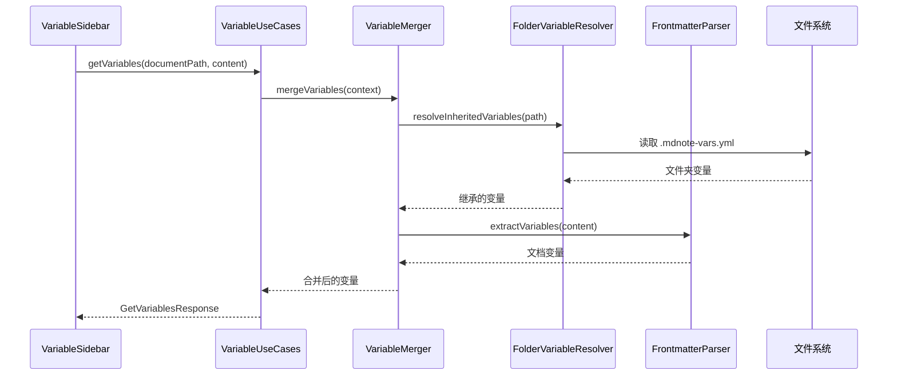
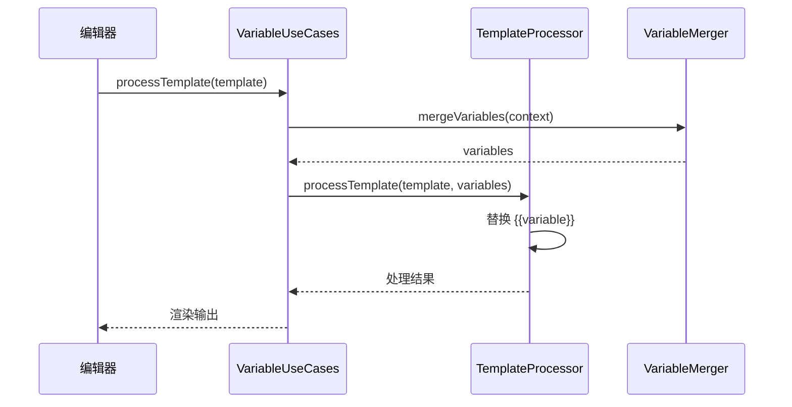

# 变量系统实现文档

## 修改概述

本次提交实现了 MDNote 的**变量系统**，允许用户在 Markdown 文档中使用变量，支持多层次的变量来源和自动合并。

**修改日期**: 2024-12-27
**分支**: wjz-branch

---

## 功能特性

### 1. 变量来源

变量系统支持四个层级的变量来源，按优先级从高到低：

1. **运行时变量** - 优先级最高，可以在运行时动态注入
2. **文档变量** - 存储在文档的 Frontmatter 中
3. **文件夹变量** - 继承自文件夹的 `.mdnote-vars.yml` 或 `.mdnote-vars.json` 文件
4. **全局变量** - 应用级别的全局配置

### 2. 变量语法

支持 `{{variableName}}` 语法进行变量替换：

```markdown
---
variables:
  author: "张三"
  date: "2024-12-27"
---

# 欢迎使用变量

作者: {{author}}
日期: {{date}}
```

### 3. 变量继承

文件夹变量支持**递归继承**，子文件夹会自动继承父文件夹的所有变量。

---

## 架构设计

### 分层架构

变量系统遵循项目的 DDD 分层架构：

```
┌─────────────────────────────────────────┐
│  Presentation Layer (表现层)            │
│  - VariableSidebar.vue                  │  UI组件
│  - 变量管理界面                          │
└─────────────────────────────────────────┘
                  ↓
┌─────────────────────────────────────────┐
│  Application Layer (应用层)             │
│  - VariableUseCases                     │  用例编排
│  - variable.dto.ts                      │  DTO定义
└─────────────────────────────────────────┘
                  ↓
┌─────────────────────────────────────────┐
│  Domain Layer (领域层)                  │
│  - FolderVariableResolver               │  文件夹变量解析
│  - FrontmatterParser                    │  Frontmatter解析
│  - SimpleTemplateProcessor              │  模板处理
│  - VariableMerger                       │  变量合并
└─────────────────────────────────────────┘
                  ↓
┌─────────────────────────────────────────┐
│  Infrastructure Layer (基础设施层)       │
│  - Electron文件系统API                  │  文件读写
└─────────────────────────────────────────┘
```

---

## 核心组件

### 1. Domain Services（领域服务）

#### FolderVariableResolver
**职责**: 管理文件夹级别的变量

**功能**:
- 从 `.mdnote-vars.yml` 或 `.mdnote-vars.json` 读取变量
- 支持变量缓存（基于文件修改时间）
- 递归解析父文件夹变量（继承）
- 保存文件夹变量到文件

**文件**: `src/domain/services/folder-variable-resolver.service.ts`

**关键方法**:
```typescript
// 解析文件夹变量
async resolveFolderVariables(folderPath: string): Promise<Record<string, any>>

// 递归解析继承变量
async resolveInheritedVariables(folderPath: string): Promise<Record<string, any>>

// 保存文件夹变量
async saveFolderVariables(
  folderPath: string,
  variables: Record<string, any>,
  format: 'yml' | 'json'
): Promise<void>
```

#### FrontmatterParser
**职责**: 解析 Markdown 文档的 Frontmatter

**功能**:
- 提取 Frontmatter 中的变量
- 添加/更新/删除文档变量
- 自动维护 Frontmatter 格式

**文件**: `src/domain/services/frontmatter-parser.service.ts`

**关键方法**:
```typescript
// 提取变量
extractVariables(content: string): FrontmatterVariables

// 添加变量
addVariable(content: string, key: string, value: any): string

// 删除变量
removeVariable(content: string, key: string): string
```

#### SimpleTemplateProcessor
**职责**: 处理模板变量替换

**功能**:
- 替换 `{{variable}}` 占位符
- 支持嵌套变量访问 `{{user.name}}`
- 变量名验证

**文件**: `src/domain/services/simple-template-processor.service.ts`

#### VariableMerger
**职责**: 合并多个来源的变量

**功能**:
- 按优先级合并变量
- 追踪变量来源
- 缓存合并结果

**文件**: `src/domain/services/variable-merger.service.ts`

### 2. Application Layer（应用层）

#### VariableUseCases
**职责**: 编排变量管理的用例

**功能**:
- 获取/设置/删除文档变量
- 获取/保存文件夹变量
- 处理模板
- 查询变量来源
- 缓存管理

**文件**: `src/application/usecases/variable.usecases.ts`

**主要用例**:
```typescript
// 获取所有变量
getVariables(request: GetVariablesRequest): Promise<GetVariablesResponse>

// 处理模板
processTemplate(request: ProcessTemplateRequest): Promise<ProcessTemplateResponse>

// 设置文档变量
setDocumentVariable(request: SetDocumentVariableRequest): Promise<SetDocumentVariableResponse>

// 删除文档变量
removeDocumentVariable(request: RemoveDocumentVariableRequest): Promise<RemoveDocumentVariableResponse>

// 获取文件夹变量
getFolderVariables(request: GetFolderVariablesRequest): Promise<GetFolderVariablesResponse>

// 保存文件夹变量
saveFolderVariables(request: SaveFolderVariablesRequest): Promise<SaveFolderVariablesResponse>
```

### 3. Presentation Layer（表现层）

#### VariableSidebar.vue
**职责**: 变量管理 UI 组件

**功能**:
- 三种变量来源的选项卡（文档/文件夹/全局）
- 变量列表展示
- 添加/编辑/删除变量
- 变量预览
- 复制变量名到剪贴板

**文件**: `src/presentation/components/VariableSidebar.vue`

**UI特性**:
- 响应式设计
- 变量来源标识
- 变量类型选择（字符串/数字/布尔/多行文本）
- 变量验证和错误提示

---

## 数据流

### 变量解析流程



### 模板处理流程



---

## 技术实现

### 依赖注入

使用 InversifyJS 进行依赖注入：

**类型定义** (`src/core/container/container.types.ts`):
```typescript
export const TYPES = {
  // ... 其他类型
  VariableUseCases: Symbol.for('VariableUseCases'),
  SimpleTemplateProcessor: Symbol.for('SimpleTemplateProcessor'),
  FrontmatterParser: Symbol.for('FrontmatterParser'),
  FolderVariableResolver: Symbol.for('FolderVariableResolver'),
  VariableMerger: Symbol.for('VariableMerger'),
};
```

**模块绑定** (`src/core/modules/application.module.ts`):
```typescript
// 变量系统
container.bind<VariableUseCases>(TYPES.VariableUseCases)
  .to(VariableUseCases)
  .inSingletonScope();

container.bind<FolderVariableResolver>(TYPES.FolderVariableResolver)
  .to(FolderVariableResolver)
  .inSingletonScope();

container.bind<FrontmatterParser>(TYPES.FrontmatterParser)
  .to(FrontmatterParser)
  .inSingletonScope();

container.bind<SimpleTemplateProcessor>(TYPES.SimpleTemplateProcessor)
  .to(SimpleTemplateProcessor)
  .inSingletonScope();

container.bind<VariableMerger>(TYPES.VariableMerger)
  .to(VariableMerger)
  .inSingletonScope();
```

### 依赖库

- **gray-matter**: Frontmatter 解析
- **yaml**: YAML 文件读写

---

## 使用示例

### 1. 在文档中使用变量

```markdown
---
variables:
  title: "我的文档"
  author: "张三"
  version: 1.0
---

# {{title}}

**作者**: {{author}}
**版本**: {{version}}
```

### 2. 创建文件夹变量

在文件夹中创建 `.mdnote-vars.yml`:

```yaml
company: "ABC公司"
department: "技术部"
email: "tech@abc.com"
```

该文件夹下的所有文档都可以使用这些变量。

### 3. 变量继承

```
/project/
  .mdnote-vars.yml        (包含 project: "Project A")
  /backend/
    .mdnote-vars.yml      (包含 apiVersion: "v2")
    doc.md                (可使用 project 和 apiVersion)
```

---

## API 参考

### DTO 定义

**文件**: `src/application/dto/variable.dto.ts`

主要接口：

- `GetVariablesRequest` / `GetVariablesResponse`
- `ProcessTemplateRequest` / `ProcessTemplateResponse`
- `SetDocumentVariableRequest` / `SetDocumentVariableResponse`
- `RemoveDocumentVariableRequest` / `RemoveDocumentVariableResponse`
- `GetFolderVariablesRequest` / `GetFolderVariablesResponse`
- `SaveFolderVariablesRequest` / `SaveFolderVariablesResponse`
- `GetVariableOriginRequest` / `GetVariableOriginResponse`

---

## 测试

新增测试目录：

- `src/application/usecases/__tests__/`
- `src/domain/services/__tests__/`

测试覆盖：
- 变量解析和合并
- Frontmatter 操作
- 模板处理
- 缓存机制

---

## 配置文件变更

### 修改的文件

1. **核心配置**:
   - `src/core/application.ts` - 添加 VariableUseCases 导出
   - `src/core/container/container.types.ts` - 添加类型定义
   - `src/core/modules/application.module.ts` - 添加依赖注入绑定

2. **应用启动**:
   - `src/application/index.ts` - 导出变量相关类型
   - `src/application/services/application.service.ts` - 添加变量系统支持

3. **UI 集成**:
   - `src/App.vue` - 集成 VariableSidebar
   - `src/presentation/components/NewAppLayout.vue` - 布局调整
   - `src/presentation/components/SidebarIconBar.vue` - 添加变量按钮

4. **构建配置**:
   - `package.json` - 添加 gray-matter 和 yaml 依赖
   - `vite.config.ts` - Vite 配置更新

---

## 清理工作

删除的文档文件：
- `CODE_STRUCTURE.md`
- `DocumentCore_Architecture_Design.md`
- `GIT_INTEGRATION_GUIDE.md`
- `Knowledge_Fragment_Reference_Implementation_Plan.md`
- `MDNote需求分析文档 .pdf`
- `MERMAID_FIX_SOLUTION.md`
- `MERMAID_FIX_TESTING.md`
- `知识管理上下文设计方案文档`

这些文档已被整合到新的文档结构中（`docs/` 目录）。

---

## 后续计划

1. **性能优化**:
   - 增量变量解析
   - 更智能的缓存失效策略

2. **功能增强**:
   - 支持条件渲染 `{{#if}}`
   - 支持循环 `{{#each}}`
   - 支持过滤器 `{{variable | uppercase}}`

3. **UI 改进**:
   - 变量模板库
   - 变量使用统计
   - 变量引用跳转

---

## 总结

本次实现完成了一个功能完整、架构清晰的变量系统，遵循项目的 DDD 设计原则，提供了良好的用户体验和扩展性。

**关键亮点**:
- ✅ 清晰的分层架构
- ✅ 完整的依赖注入
- ✅ 直观的 UI 界面
- ✅ 灵活的变量继承
- ✅ 高效的缓存机制
- ✅ 良好的错误处理
