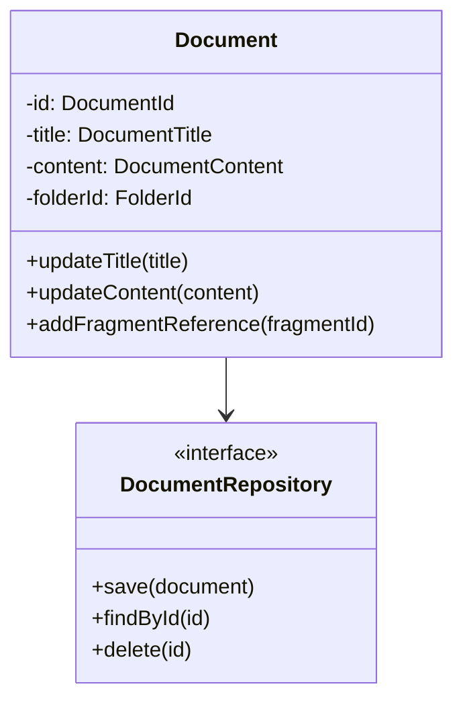
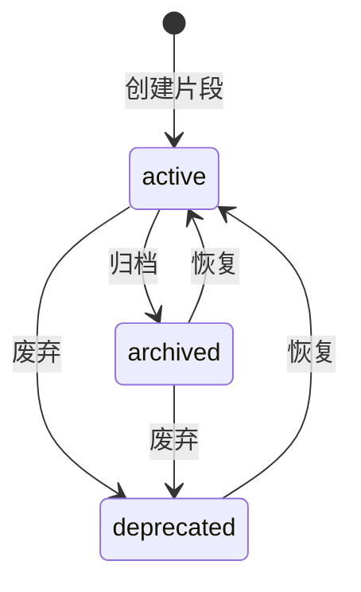

# 软件设计文档

## 1. 概述

### 1.1 文档目的

本文档描述知识管理系统的软件架构设计和详细设计。

### 1.2 系统范围

系统包含以下核心模块：
- 文档管理模块
- 知识片段管理模块
- 导出模块
- 图谱可视化模块

## 2. 架构设计

### 2.1 整体架构

系统采用分层架构设计：

```
┌─────────────────────────────────────┐
│           表现层 (Presentation)      │
├─────────────────────────────────────┤
│           应用层 (Application)       │
├─────────────────────────────────────┤
│           领域层 (Domain)            │
├─────────────────────────────────────┤
│           基础设施层 (Infrastructure) │
└─────────────────────────────────────┘
```

### 2.2 技术选型

| 层次 | 技术栈 |
|------|--------|
| 表现层 | Vue 3 + TypeScript |
| 应用层 | 用例模式 (Use Cases) |
| 领域层 | DDD 实体与值对象 |
| 基础设施层 | Electron + 文件系统 |

## 3. 模块设计

### 3.1 文档模块

#### 3.1.1 类图



### 3.2 知识片段模块

#### 3.2.1 状态流转



## 4. 数据设计

### 4.1 存储结构

```
vault/
├── .vault/
│   ├── index.json
│   ├── graph.json
│   ├── health.json
│   └── lineage.json
├── documents/
│   ├── index.json
│   └── *.md
├── fragments/
│   └── index.json
├── templates/
└── config.json
```

## 5. 接口设计

### 5.1 文档操作接口

| 操作 | 方法 | 描述 |
|------|------|------|
| 创建文档 | createDocument | 创建新文档 |
| 更新文档 | updateDocument | 更新文档内容 |
| 删除文档 | deleteDocument | 删除指定文档 |
| 获取文档 | getDocument | 获取文档详情 |


{{ref:frag-002-class:linked}}


