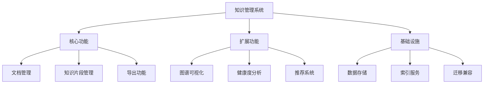

# 项目计划文档

## 1. 项目概述

### 1.1 项目名称

知识管理系统 (MD Note)

### 1.2 项目目标

构建一个以知识资产为核心的文档管理系统，支持：
- 文档与知识片段的分离管理
- 知识片段的可复用与演化追踪
- 基于可信度的内容筛选导出

## 2. 项目组织

### 2.1 项目团队

| 角色 | 职责 |
|------|------|
| 项目经理 | 整体规划与进度控制 |
| 架构师 | 技术架构设计 |
| 开发工程师 | 功能开发 |
| 测试工程师 | 质量保障 |

### 2.2 沟通机制

- 每日站会：15分钟，同步进度
- 周例会：1小时，回顾与计划
- 代码评审：每个 PR 必须经过评审

## 3. 工作分解结构 (WBS)

## 4. 进度计划

### 4.1 里程碑

| 里程碑 | 日期 | 交付物 |
|--------|------|--------|
| M1 - 基础架构 | 2026-03-01 | 项目骨架、核心实体 |
| M2 - 文档功能 | 2026-03-15 | 文档 CRUD 完成 |
| M3 - 片段功能 | 2026-04-01 | 片段管理完成 |
| M4 - 资产化 | 2026-04-15 | 元数据、状态、可信度 |
| M5 - 导出功能 | 2026-04-30 | 导出过滤完成 |
| M6 - 发布 | 2026-05-15 | v2.0 正式发布 |

### 4.2 迭代计划

| 迭代 | 时间 | 目标 |
|------|------|------|
| Sprint 1 | Week 1-2 | 文档基础功能 |
| Sprint 2 | Week 3-4 | 知识片段基础 |
| Sprint 3 | Week 5-6 | 资产化元数据 |
| Sprint 4 | Week 7-8 | 导出与过滤 |

## 5. 风险管理

### 5.1 风险识别

| 风险ID | 风险描述 | 可能性 | 影响程度 | 应对策略 |
|--------|----------|--------|----------|----------|
| R1 | 需求变更频繁 | 中 | 高 | 采用敏捷开发，快速响应 |
| R2 | 技术债务积累 | 中 | 中 | 定期重构，代码评审 |
| R3 | 数据迁移问题 | 低 | 高 | 充分测试，保留回滚机制 |

## 6. 质量保证

### 6.1 质量目标

- 代码覆盖率 ≥ 80%
- 无 P0 级别缺陷
- 性能指标达标

### 6.2 评审机制

- 需求评审：每个迭代开始前
- 设计评审：重大功能开发前
- 代码评审：每次提交前
