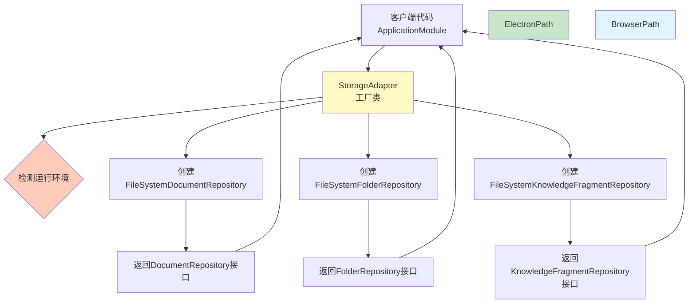
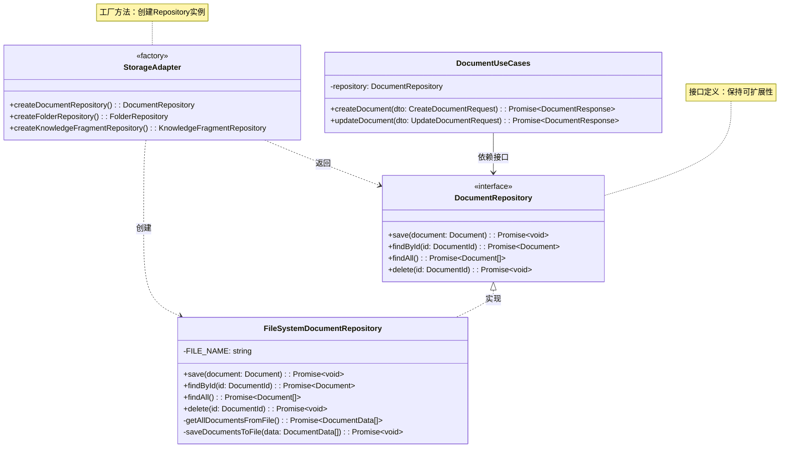
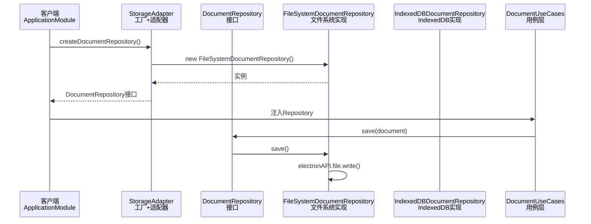

# 工厂模式实现说明

## 一、设计模式概述

在MDNote项目中，`StorageAdapter` 类运用了**工厂模式**，实现了存储层的统一创建和管理。由于项目专注于Electron桌面应用，使用文件系统存储，因此采用简单的工厂模式即可满足需求。

---

## 二、工厂模式（Factory Pattern）

### 2.1 模式定义

**工厂模式**：提供一个创建对象的接口，让子类决定实例化哪一个类。工厂方法让类的实例化推迟到子类中进行。

### 2.2 在项目中的实现

`StorageAdapter` 使用**静态工厂方法**，根据运行环境自动创建合适的Repository实例。

**核心代码**：
```typescript
export class StorageAdapter {
  // 环境检测
  private static isElectron(): boolean {
    return typeof window !== 'undefined' &&
           !!(window as any).electronAPI &&
           !!(window as any).electronAPI.file;
  }

  // 工厂方法：创建文档仓储
  static createDocumentRepository(): DocumentRepository {
    return new FileSystemDocumentRepository();  // 直接创建文件系统实现
  }

  // 工厂方法：创建文件夹仓储
  static createFolderRepository(): FolderRepository {
    return new FileSystemFolderRepository();
  }

  // 工厂方法：创建知识片段仓储
  static createKnowledgeFragmentRepository(): KnowledgeFragmentRepository {
    return new FileSystemKnowledgeFragmentRepository();
  }
}
```

### 2.3 工厂模式的优势

1. **封装创建逻辑**：客户端不需要知道具体创建哪个实现类
2. **统一创建入口**：所有Repository都通过StorageAdapter创建
3. **易于扩展**：未来如需切换存储实现，只需修改工厂方法
4. **依赖注入友好**：便于集成到依赖注入容器中

### 2.4 工厂模式流程图



---

## 三、Repository接口设计

### 3.1 接口定义

虽然项目当前只使用文件系统存储，但通过Repository接口设计，保持了良好的可扩展性。

**接口定义**（Domain层）：
```typescript
// Domain层定义接口
export interface DocumentRepository {
  save(document: Document): Promise<void>;
  findById(id: DocumentId): Promise<Document | null>;
  findAll(): Promise<Document[]>;
  findByFolderId(folderId: FolderId): Promise<Document[]>;
  delete(id: DocumentId): Promise<void>;
  search(query: string): Promise<Document[]>;
}
```

**文件系统实现**（Infrastructure层）：
```typescript
// 文件系统实现
export class FileSystemDocumentRepository implements DocumentRepository {
  async save(document: Document): Promise<void> {
    // 通过Electron IPC写入文件
    await electronAPI.file.write('documents.json', data);
  }
  // ... 其他方法
}
```

### 3.2 接口设计的优势

1. **依赖倒置**：Domain层只依赖接口，不依赖具体实现
2. **易于测试**：可以使用Mock实现进行单元测试
3. **未来扩展**：如需切换存储实现，只需实现Repository接口
4. **解耦合**：业务逻辑与存储技术解耦

### 3.3 Repository类图



---

## 四、工厂模式的使用

### 4.1 设计说明

在MDNote项目中，由于专注于Electron桌面应用，使用文件系统存储，因此采用简单的工厂模式即可满足需求：

- **工厂模式**：负责创建Repository实例
- **接口设计**：Repository接口保持可扩展性，便于未来扩展

### 4.2 完整调用流程



### 4.3 实际使用示例

**在ApplicationModule中的使用**：
```typescript
export class ApplicationModule {
  static configure(container: ServiceContainer): void {
    // 使用工厂方法创建Repository实例
    container.bind<DocumentRepository>(TYPES.DocumentRepository)
      .toConstantValue(StorageAdapter.createDocumentRepository());
    
    container.bind<FolderRepository>(TYPES.FolderRepository)
      .toConstantValue(StorageAdapter.createFolderRepository());

    container.bind(TYPES.KnowledgeFragmentRepository)
      .toConstantValue(StorageAdapter.createKnowledgeFragmentRepository());
  }
}
```

**在UseCase中的使用**：
```typescript
export class DocumentUseCases {
  constructor(
    @inject(TYPES.DocumentRepository)
    private readonly repository: DocumentRepository  // 只依赖接口
  ) {}

  async createDocument(dto: CreateDocumentRequest): Promise<DocumentResponse> {
    const document = Document.create(/* ... */);
    await this.repository.save(document);  // 调用接口方法
    return this.mapToResponse(document);
  }
}
```

---

## 五、设计优势总结

### 5.1 工厂模式带来的好处

✅ **统一创建入口**：所有Repository都通过StorageAdapter创建
✅ **环境自适应**：自动检测环境并选择最优实现
✅ **易于扩展**：新增存储实现只需修改工厂方法
✅ **代码复用**：避免在多个地方重复创建逻辑

### 5.2 接口设计的优势

✅ **依赖倒置**：Domain层只依赖接口，不依赖具体实现
✅ **易于测试**：可以使用Mock实现进行单元测试
✅ **未来扩展**：如需切换存储实现，只需实现Repository接口
✅ **解耦合**：业务逻辑与存储技术解耦

### 5.3 设计优势总结

✅ **简单高效**：工厂模式简单直接，满足当前需求
✅ **易于维护**：统一的创建入口，便于管理
✅ **可扩展性**：Repository接口设计保持未来扩展的可能性
✅ **向后兼容**：未来如需切换存储实现，只需修改工厂方法

---

## 六、扩展示例

### 6.1 如何添加新的存储实现

假设要添加SQLite存储支持：

**步骤1：实现Repository接口**
```typescript
export class SQLiteDocumentRepository implements DocumentRepository {
  async save(document: Document): Promise<void> {
    // SQLite实现
  }
  // ... 其他方法
}
```

**步骤2：在工厂方法中添加创建逻辑**
```typescript
static createDocumentRepository(): DocumentRepository {
  // 可以添加配置选项
  if (config.useSQLite) {
    return new SQLiteDocumentRepository();
  }
  return new FileSystemDocumentRepository();  // 默认使用文件系统
}
```

**步骤3：业务代码无需修改**
- UseCase层代码保持不变
- Domain层代码保持不变
- 只需修改配置即可切换存储实现

---

## 七、总结

`StorageAdapter` 通过**工厂模式**，实现了：

1. **统一的创建入口**：所有Repository通过工厂方法创建
2. **封装创建逻辑**：客户端代码不需要知道具体实现类
3. **接口设计**：Repository接口保持可扩展性
4. **高度解耦**：业务逻辑与存储技术完全解耦
5. **易于扩展**：未来如需切换存储实现，只需修改工厂方法

这种设计使得MDNote的存储层既简单又易于维护，为未来的扩展提供了良好的基础。由于项目专注于Electron桌面应用，使用文件系统存储，因此采用简单的工厂模式即可满足需求。

